[TOC]


## Task
```mermaid
flowchart TD
    Start(["Início da loopTask()"])
    CheckScreen{"WidgetBase::loadScreen está definida?"}
    CallScreen["Chama WidgetBase::loadScreen()"]
    NullScreen["Zera WidgetBase::loadScreen (nullptr)"]
    Delay5ms1["vTaskDelay(5ms)"]
    ProcessLog["processLogQueue: Processa fila de logs (SD/logs)"]
    ProcessCallback["processCallback: Executa callbacks pendentes"]
    TouchEnabled{"Touch está habilitado? (HAS_TOUCH)"}
    GetTouch["Lê touch: xTouch, yTouch, zPressure, gesture"]
    TouchDetected{"Touch detectado? (hasTouch)"}
    DebugTouch{"Debug Touch ativado? (m_debugTouch)"}
    DrawCircle["Desenha círculo rosa no ponto de toque"]
    CallProcessTouch["processTouchEvent: Processa evento de toque"]
    UpdateWidgets["updateWidgets: Atualiza todos os widgets"]
    UpdateCircularBar["updateCircularBar"]
    UpdateGauge["updateGauge"]
    UpdateLabel["updateLabel"]
    UpdateLed["updateLed"]
    UpdateLineChart["updateLineChart"]
    UpdateVBar["updateVBar"]
    UpdateVAnalog["updateVAnalog"]
    UpdateCheckbox["updateCheckbox"]
    UpdateCircleButton["updateCircleButton"]
    UpdateHSlider["updateHSlider"]
    UpdateRadioGroup["updateRadioGroup"]
    UpdateRectButton["updateRectButton"]
    UpdateToggle["updateToggle"]
    UpdateTextButton["updateTextButton"]
    UpdateSpinbox["updateSpinbox"]
    UpdateNumberBox["updateNumberBox"]
    UpdateTextBox["updateTextBox"]
    CalcTime["Calcula tempo de execução"]
    Delay5ms2["vTaskDelay(5ms)"]
    End(["Fim da iteração da task"])

    Start --> CheckScreen
    CheckScreen -- "Sim" --> CallScreen
    CallScreen --> NullScreen
    NullScreen --> Delay5ms1
    Delay5ms1 --> ProcessLog
    CheckScreen -- "Não" --> ProcessLog
    ProcessLog --> ProcessCallback
    ProcessCallback --> TouchEnabled
    TouchEnabled -- "Sim" --> GetTouch
    GetTouch --> TouchDetected
    TouchDetected -- "Sim" --> DebugTouch
    DebugTouch -- "Sim" --> DrawCircle
    DrawCircle --> CallProcessTouch
    DebugTouch -- "Não" --> CallProcessTouch
    CallProcessTouch --> UpdateWidgets
    TouchDetected -- "Não" --> UpdateWidgets
    TouchEnabled -- "Não" --> UpdateWidgets
    UpdateWidgets --> UpdateCircularBar
    UpdateCircularBar --> UpdateGauge
    UpdateGauge --> UpdateLabel
    UpdateLabel --> UpdateLed
    UpdateLed --> UpdateLineChart
    UpdateLineChart --> UpdateVBar
    UpdateVBar --> UpdateVAnalog
    UpdateVAnalog --> UpdateCheckbox
    UpdateCheckbox --> UpdateCircleButton
    UpdateCircleButton --> UpdateHSlider
    UpdateHSlider --> UpdateRadioGroup
    UpdateRadioGroup --> UpdateRectButton
    UpdateRectButton --> UpdateToggle
    UpdateToggle --> UpdateTextButton
    UpdateTextButton --> UpdateSpinbox
    UpdateSpinbox --> UpdateNumberBox
    UpdateNumberBox --> UpdateTextBox
    UpdateTextBox --> CalcTime
    CalcTime --> Delay5ms2
    Delay5ms2 --> End
```

## Fluxo detalhado: processTouchEvent
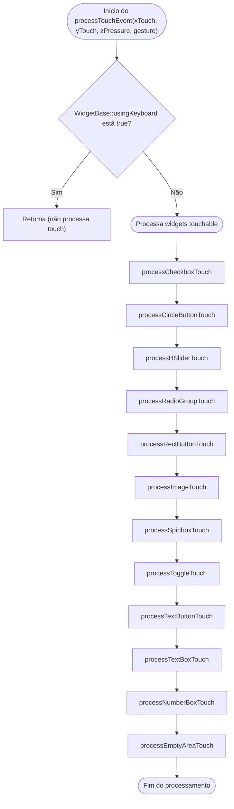

**Descrição:**
- Se o teclado virtual está ativo (`usingKeyboard`), a função retorna imediatamente e não processa nenhum widget.
- Caso contrário, a função chama sequencialmente os métodos de processamento de toque para cada tipo de widget interativo (Checkbox, CircleButton, HSlider, etc.), passando as coordenadas do toque.
- Cada função verifica se o toque ocorreu em algum widget daquele tipo e, se sim, agenda o callback correspondente.
- O fluxo termina após tentar processar todos os tipos de widgets touchable.


## Fluxo detalhado: processNumberBoxTouch
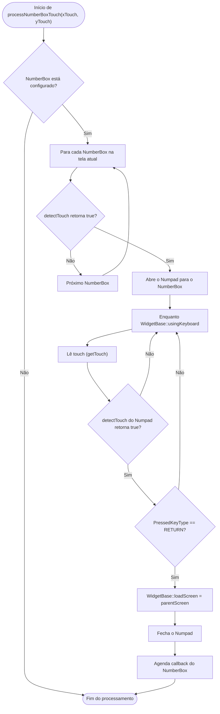

**Descrição:**
- Para cada NumberBox configurado, verifica se houve toque.
- Se sim, abre o Numpad e entra em um loop aguardando interação.
- Se o usuário pressionar RETURN no Numpad, fecha o teclado, retorna para a tela original e agenda o callback do NumberBox.

---

## Fluxo detalhado: processTextBoxTouch
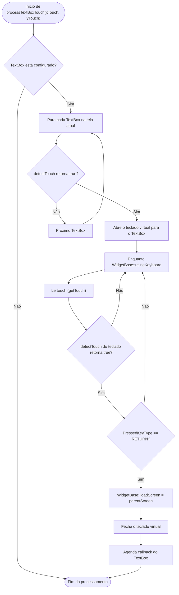

**Descrição:**
- Para cada TextBox configurado, verifica se houve toque.
- Se sim, abre o teclado virtual e entra em um loop aguardando interação.
- Se o usuário pressionar RETURN no teclado, fecha o teclado, retorna para a tela original e agenda o callback do TextBox.

## Fluxo detalhado: processCheckboxTouch
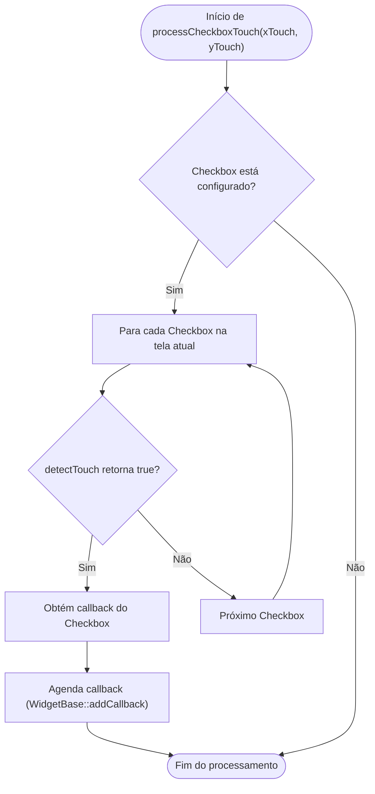

---

## Fluxo detalhado: processCircleButtonTouch


---

## Fluxo detalhado: processHSliderTouch
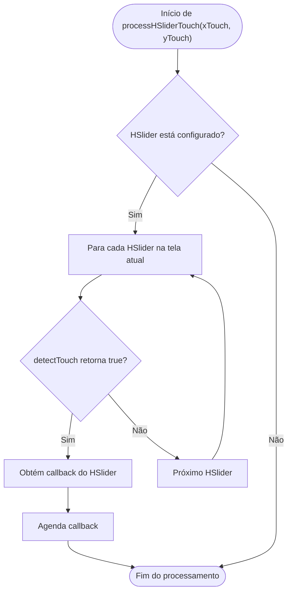

---

## Fluxo detalhado: processRadioGroupTouch
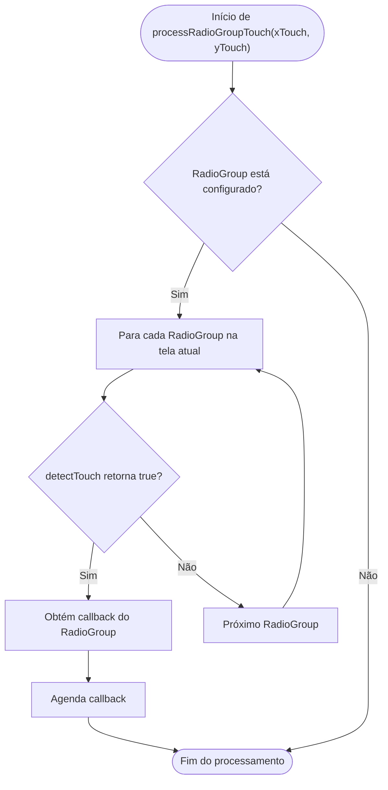

---

## Fluxo detalhado: processRectButtonTouch


---

## Fluxo detalhado: processImageTouch
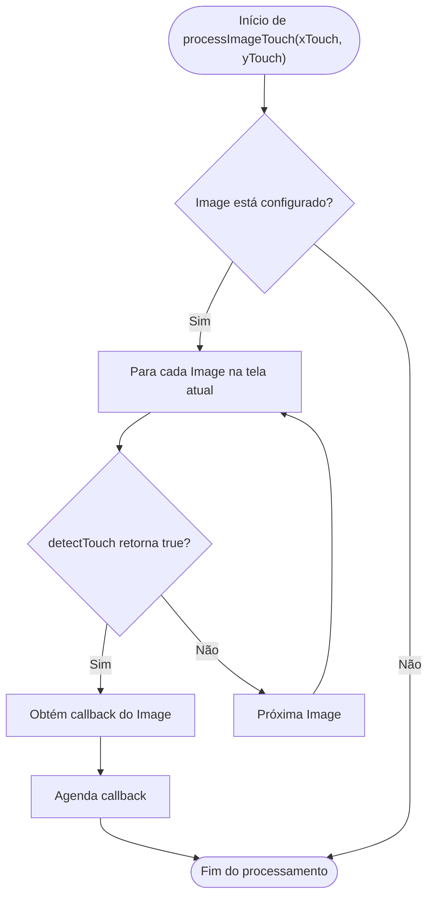

---

## Fluxo detalhado: processSpinboxTouch


---

## Fluxo detalhado: processToggleTouch
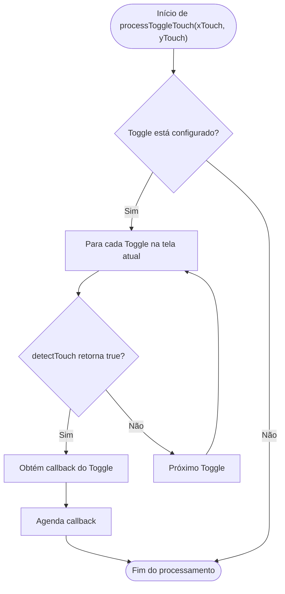

---

## Fluxo detalhado: processTextButtonTouch
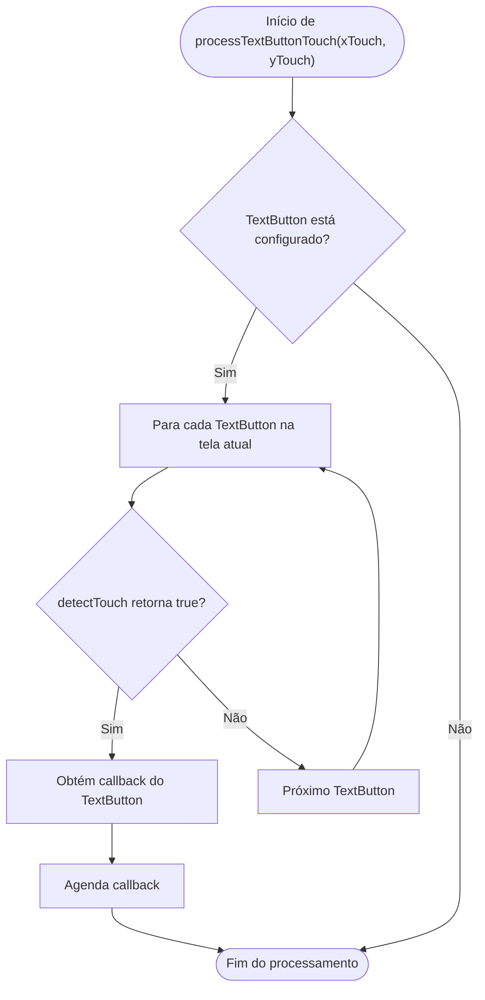

---

## Fluxo detalhado: processEmptyAreaTouch
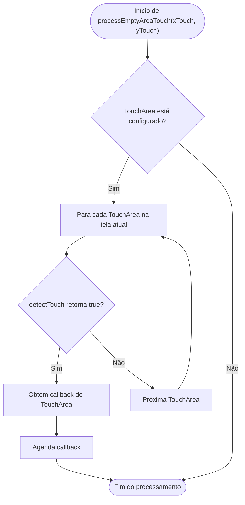

## Fluxo detalhado: updateCircularBar
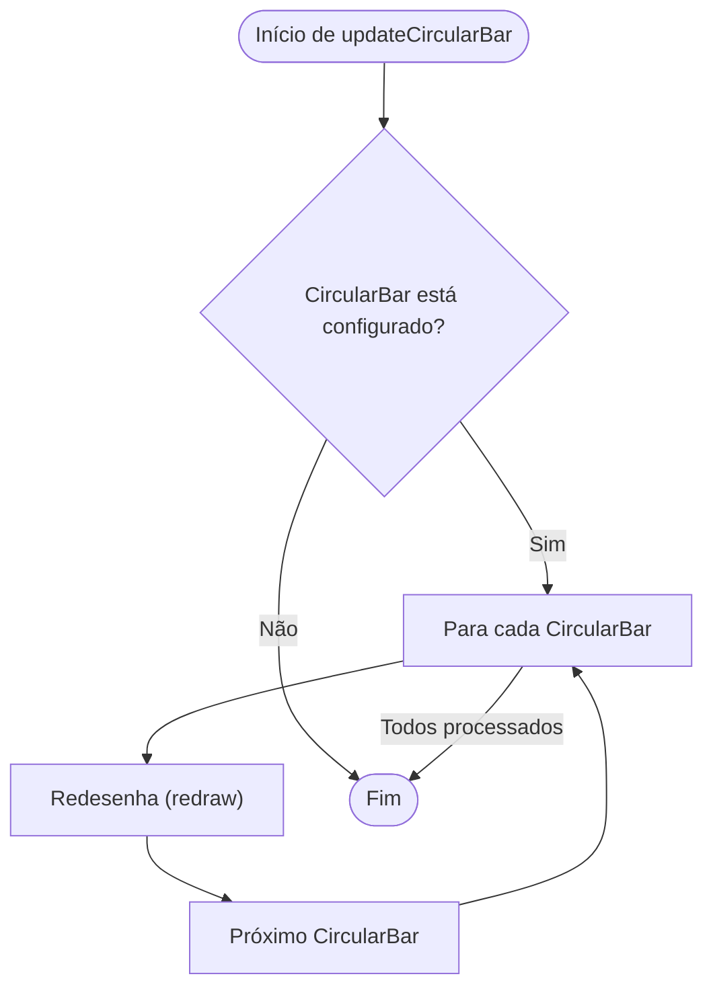

---

## Fluxo detalhado: updateGauge
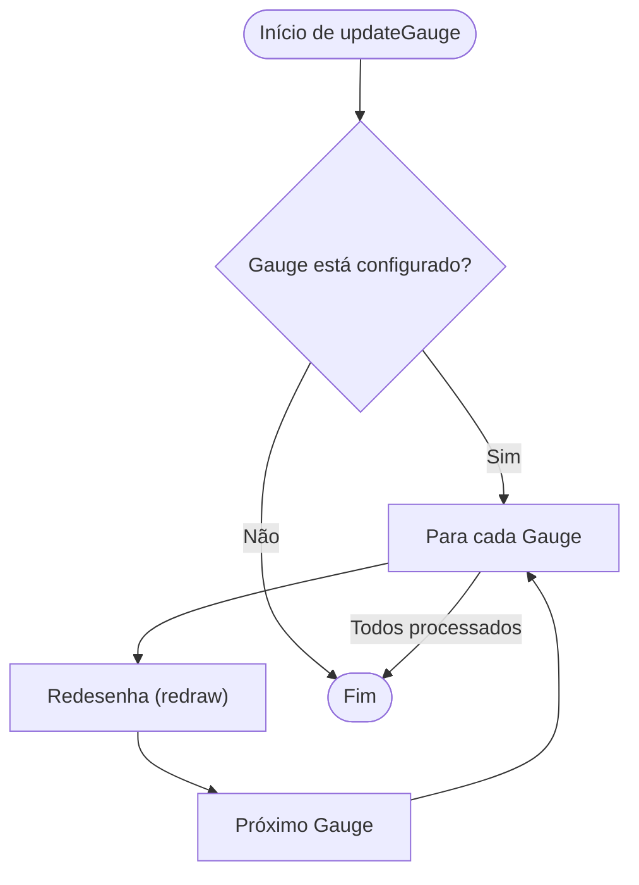

---

## Fluxo detalhado: updateLabel
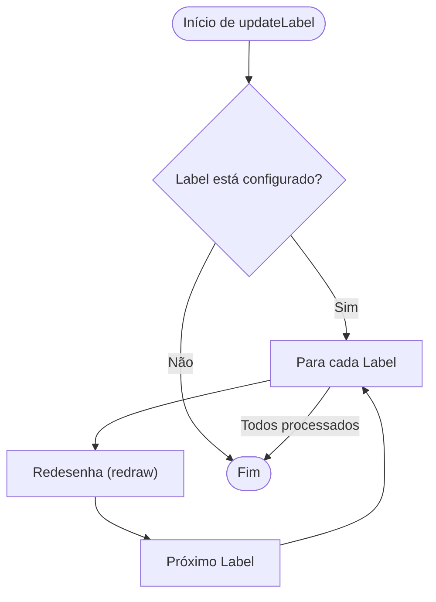

---

## Fluxo detalhado: updateLed
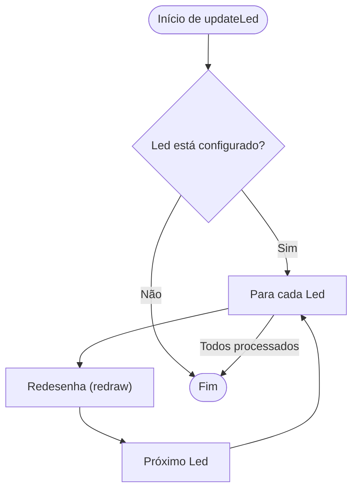

---

## Fluxo detalhado: updateLineChart
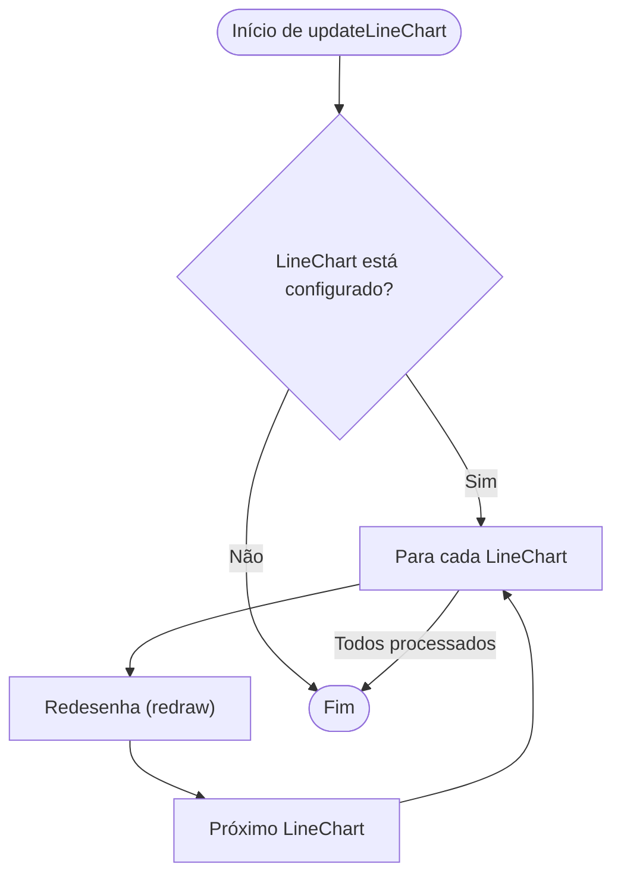

---

## Fluxo detalhado: updateVBar
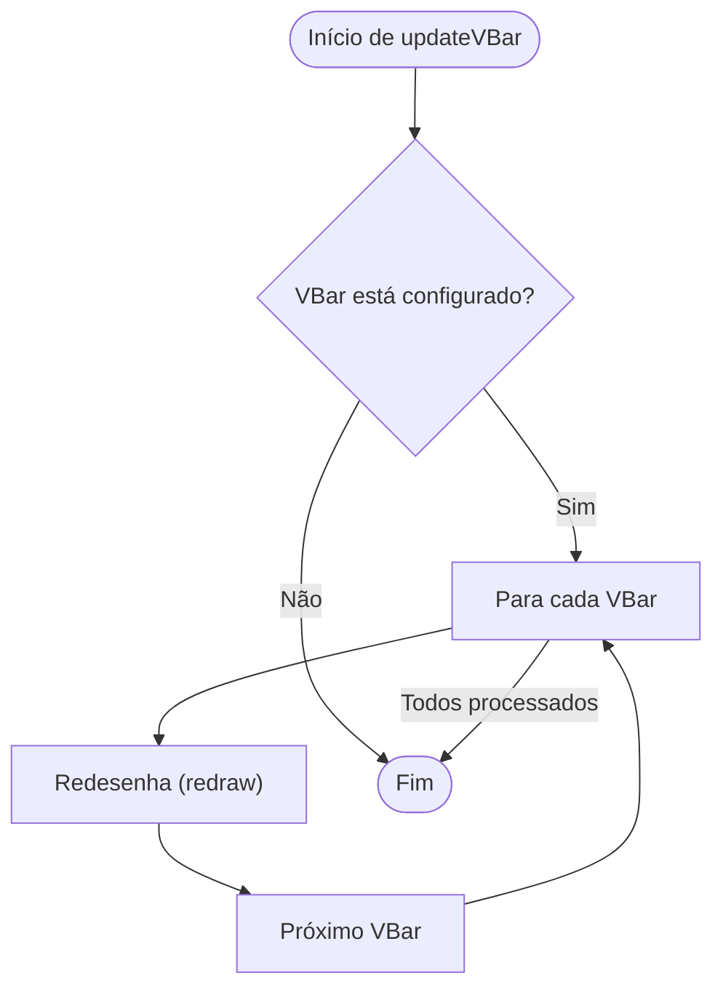

---

## Fluxo detalhado: updateVAnalog
```mermaid
flowchart TD
    StartVA(["Início de updateVAnalog"])
    CheckConfigVA{"VAnalog está configurado?"}
    ForEachVA["Para cada VAnalog"]
    RedrawVA["Redesenha (redraw)"]
    EndVA(["Fim"])
    NextVA["Próximo VAnalog"]

    StartVA --> CheckConfigVA
    CheckConfigVA -- "Sim" --> ForEachVA
    CheckConfigVA -- "Não" --> EndVA
    ForEachVA --> RedrawVA
    RedrawVA --> NextVA
    NextVA --> ForEachVA
    ForEachVA -- "Todos processados" --> EndVA
```

---

## Fluxo detalhado: updateCheckbox
```mermaid
flowchart TD
    StartCBX(["Início de updateCheckbox"])
    CheckConfigCBX{"Checkbox está configurado?"}
    ForEachCBX["Para cada Checkbox"]
    RedrawCBX["Redesenha (redraw)"]
    EndCBX(["Fim"])
    NextCBX["Próximo Checkbox"]

    StartCBX --> CheckConfigCBX
    CheckConfigCBX -- "Sim" --> ForEachCBX
    CheckConfigCBX -- "Não" --> EndCBX
    ForEachCBX --> RedrawCBX
    RedrawCBX --> NextCBX
    NextCBX --> ForEachCBX
    ForEachCBX -- "Todos processados" --> EndCBX
```

---

## Fluxo detalhado: updateCircleButton
```mermaid
flowchart TD
    StartCCB(["Início de updateCircleButton"])
    CheckConfigCCB{"CircleButton está configurado?"}
    ForEachCCB["Para cada CircleButton"]
    RedrawCCB["Redesenha (redraw)"]
    EndCCB(["Fim"])
    NextCCB["Próximo CircleButton"]

    StartCCB --> CheckConfigCCB
    CheckConfigCCB -- "Sim" --> ForEachCCB
    CheckConfigCCB -- "Não" --> EndCCB
    ForEachCCB --> RedrawCCB
    RedrawCCB --> NextCCB
    NextCCB --> ForEachCCB
    ForEachCCB -- "Todos processados" --> EndCCB
```

---

## Fluxo detalhado: updateHSlider
```mermaid
flowchart TD
    StartHS(["Início de updateHSlider"])
    CheckConfigHS{"HSlider está configurado?"}
    ForEachHS["Para cada HSlider"]
    RedrawHS["Redesenha (redraw)"]
    EndHS(["Fim"])
    NextHS["Próximo HSlider"]

    StartHS --> CheckConfigHS
    CheckConfigHS -- "Sim" --> ForEachHS
    CheckConfigHS -- "Não" --> EndHS
    ForEachHS --> RedrawHS
    RedrawHS --> NextHS
    NextHS --> ForEachHS
    ForEachHS -- "Todos processados" --> EndHS
```

---

## Fluxo detalhado: updateRadioGroup
```mermaid
flowchart TD
    StartRG(["Início de updateRadioGroup"])
    CheckConfigRG{"RadioGroup está configurado?"}
    ForEachRG["Para cada RadioGroup"]
    RedrawRG["Redesenha (redraw)"]
    EndRG(["Fim"])
    NextRG["Próximo RadioGroup"]

    StartRG --> CheckConfigRG
    CheckConfigRG -- "Sim" --> ForEachRG
    CheckConfigRG -- "Não" --> EndRG
    ForEachRG --> RedrawRG
    RedrawRG --> NextRG
    NextRG --> ForEachRG
    ForEachRG -- "Todos processados" --> EndRG
```

---

## Fluxo detalhado: updateRectButton
```mermaid
flowchart TD
    StartRB(["Início de updateRectButton"])
    CheckConfigRB{"RectButton está configurado?"}
    ForEachRB["Para cada RectButton"]
    RedrawRB["Redesenha (redraw)"]
    EndRB(["Fim"])
    NextRB["Próximo RectButton"]

    StartRB --> CheckConfigRB
    CheckConfigRB -- "Sim" --> ForEachRB
    CheckConfigRB -- "Não" --> EndRB
    ForEachRB --> RedrawRB
    RedrawRB --> NextRB
    NextRB --> ForEachRB
    ForEachRB -- "Todos processados" --> EndRB
```

---

## Fluxo detalhado: updateToggle
```mermaid
flowchart TD
    StartTG(["Início de updateToggle"])
    CheckConfigTG{"Toggle está configurado?"}
    ForEachTG["Para cada Toggle"]
    RedrawTG["Redesenha (redraw)"]
    EndTG(["Fim"])
    NextTG["Próximo Toggle"]

    StartTG --> CheckConfigTG
    CheckConfigTG -- "Sim" --> ForEachTG
    CheckConfigTG -- "Não" --> EndTG
    ForEachTG --> RedrawTG
    RedrawTG --> NextTG
    NextTG --> ForEachTG
    ForEachTG -- "Todos processados" --> EndTG
```

---

## Fluxo detalhado: updateTextButton
```mermaid
flowchart TD
    StartTBt(["Início de updateTextButton"])
    CheckConfigTBt{"TextButton está configurado?"}
    ForEachTBt["Para cada TextButton"]
    RedrawTBt["Redesenha (redraw)"]
    EndTBt(["Fim"])
    NextTBt["Próximo TextButton"]

    StartTBt --> CheckConfigTBt
    CheckConfigTBt -- "Sim" --> ForEachTBt
    CheckConfigTBt -- "Não" --> EndTBt
    ForEachTBt --> RedrawTBt
    RedrawTBt --> NextTBt
    NextTBt --> ForEachTBt
    ForEachTBt -- "Todos processados" --> EndTBt
```

---

## Fluxo detalhado: updateSpinbox
```mermaid
flowchart TD
    StartSB(["Início de updateSpinbox"])
    CheckConfigSB{"SpinBox está configurado?"}
    ForEachSB["Para cada SpinBox"]
    RedrawSB["Redesenha (redraw)"]
    EndSB(["Fim"])
    NextSB["Próximo SpinBox"]

    StartSB --> CheckConfigSB
    CheckConfigSB -- "Sim" --> ForEachSB
    CheckConfigSB -- "Não" --> EndSB
    ForEachSB --> RedrawSB
    RedrawSB --> NextSB
    NextSB --> ForEachSB
    ForEachSB -- "Todos processados" --> EndSB
```

---

## Fluxo detalhado: updateNumberBox
```mermaid
flowchart TD
    StartNB(["Início de updateNumberBox"])
    CheckConfigNB{"NumberBox está configurado?"}
    ForEachNB["Para cada NumberBox"]
    RedrawNB["Redesenha (redraw)"]
    EndNB(["Fim"])
    NextNB["Próximo NumberBox"]

    StartNB --> CheckConfigNB
    CheckConfigNB -- "Sim" --> ForEachNB
    CheckConfigNB -- "Não" --> EndNB
    ForEachNB --> RedrawNB
    RedrawNB --> NextNB
    NextNB --> ForEachNB
    ForEachNB -- "Todos processados" --> EndNB
```

---

## Fluxo detalhado: updateTextBox
```mermaid
flowchart TD
    StartTB(["Início de updateTextBox"])
    CheckConfigTB{"TextBox está configurado?"}
    ForEachTB["Para cada TextBox"]
    RedrawTB["Redesenha (redraw)"]
    EndTB(["Fim"])
    NextTB["Próximo TextBox"]

    StartTB --> CheckConfigTB
    CheckConfigTB -- "Sim" --> ForEachTB
    CheckConfigTB -- "Não" --> EndTB
    ForEachTB --> RedrawTB
    RedrawTB --> NextTB
    NextTB --> ForEachTB
    ForEachTB -- "Todos processados" --> EndTB
```


