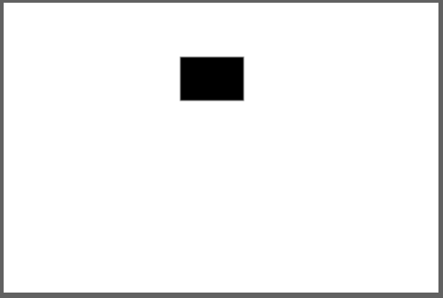
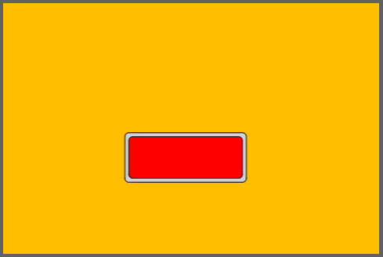
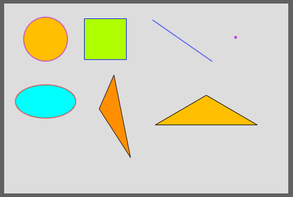
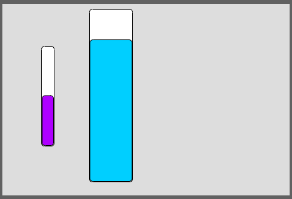

# Manual of widgets

[toc]

## Como funciona

A função dessa biblioteca é facilitar o uso de widgets interativos em displays com (ou sem) touch. O que precisa saber antes de usar?

- Só uma tela é carregada por vez.
- Existe um loop secundário (umas task) que verifica mudanças e leitura no touch do display, tudo que acontece na tela é esse loop secundário que gerencia, essa verificação é realizada fazendo leituras do touch, verificação de valores de váriaveis (como o ponteiro para troca de tela e callbacks).
- **Todos** os widgets do projeto devem ser declarados no array do tipo específico antes do uso, ou seja, cada tipo de widget (RectButton, LineChart, Checkbox...) possui um array próprio.
- Todo widget precisa no mínimo de uma posição X, Y e índice da tela ao qual pertence e individualmente das configurações próprias baseadas no seu tipo.
- Todas as figura estáticas são desenhadas primeiro (camada inferior) do que os widgets.
- A troca de telas é feita apontando uma variável para a uma função que representa a tela.
- Widgets pode ser apenas:
  - Saída (apenas mostram informações a partir do código): barra vertical, circular bar, line chart, gauge, led...
  - Entrada (recebem interações a partir do touch): RectButton, CircularButton, TextButton, Checkbox, RadioButton...
  - Estáticos (que nao verdade são forma geométricas simples e fixas, sem interação): Rect, Circle, Triangle, Line...
- Os pinos, tipo de display e touch são definidos em um arquivo (na raiz do diretório da library) chamado `user_setup.h`
- Cada widget possui uma struct de configuração própria.

## Basic code

O código abaixo é um básico de como fica um projeto com ESP32 + display ILI9488 com touch resistivo XPT2046 compartilhando a mesma SPI.

Esse projeto é pode ser definido como:

- Há duas telas (screen0 e screen1).
- Possui somente 1 widget (RectButton).
- Usa a mesma SPI display - touch (apenas pin CS diferentes).
- Na tela 0 (screen0) desenha duas formas básicas (retângulo preenchido e retângulo apenas com borda).
- O toque no widgets de botão retangular mostra uma mensagem na saída serial.

| Tela 0                                                       | Tela 1                                                       |
| ------------------------------------------------------------ | ------------------------------------------------------------ |
|  |  |


```c++
#define FORMAT_SPIFFS_IF_FAILED false // Caso use SPIFFS, avisa para não formatar em caso de falha
#define DISPLAY_W 480 // Largura da tela
#define DISPLAY_H 320 // Altura da tela

// Prototypes for each screen
void screen0(); // Tela 0
void screen1(); // Tela 1

// Prototypes for callback functions
void rectbutton0Rect_cb(); // Callback quando clica no botão


// Include external libraries and files
#include <Arduino_GFX_Library.h> // Library principal para desenho no display
#include <displayfk.h>// Library própria para criação e uso dos widgets
#include <SPI.h> // Library da comunicação SPI

// Cria o objeto SPI de acordo com o chip escolhido na IDE
#if defined(CONFIG_IDF_TARGET_ESP32S3)
SPIClass spi_shared(FSPI);
#else
SPIClass spi_shared(HSPI);
#endif

Arduino_DataBus *bus = nullptr; // Objeto para comunicação com o display (SPI, I2C...)
Arduino_GFX *tft = nullptr;// Objeto para desenha no display
uint8_t rotationScreen = 1; // Valor da rotação, cada display e projeto terá um diferente.
DisplayFK myDisplay;// Objeto que permite utilização da library DisplayFK responsável por desenhar, verificar interações com touch, executar callbacks e troca de telas.

const uint8_t qtdRectBtn = 1;//Variável que define a quantidade de botões retangulares nesse projeto
RectButton arrayRectbtn[qtdRectBtn] = {RectButton(155, 165, 1)}; // Array com TODOS os botões retangulares do projeto, o construtor precisa de posição X, posição Y e rotação.


void setup(){
    Serial.begin(115200);// Inicia comunicação serial
    spi_shared.begin(DISP_SCLK, DISP_MISO, DISP_MOSI);//Cria objeto SPI
    bus = new Arduino_HWSPI(DISP_DC, DISP_CS, DISP_SCLK, DISP_MOSI, DISP_MISO, &spi_shared);//Cria objeto para comunicação.
    tft = new Arduino_ILI9488_18bit(bus, DISP_RST, rotationScreen, false);// Cria objeto para controlar o display ILI9488
    tft->begin(DISP_FREQUENCY);// Define a frequencia da SPI para a cominucação com o display
    WidgetBase::objTFT = tft; // Diz à biblioteca qual é o objeto que será usado para desenhar.
    myDisplay.startTouchXPT2046(DISPLAY_W, DISPLAY_H, rotationScreen, TOUCH_XPT2046_CS, &spi_shared, tft);// Inicia comunicação com o touch XPT2046 via SPI
    myDisplay.recalibrate();// Telas de toque resistivo precisam de calibração, a calibração é feita a partir do valor ADC das coordenadas do toque e mapeamento para coordenadas da tela. Esses valores são armazenadas na flash do ESP32 e são recuperados a partir da função checkCalibration(). É necessário fazera calibração na primeir vez que usa o ESP32 com o display. Caso troque de display ou mude a rotação da tela, refaça essa calibração, depois da calbração executada, essa linha pode ser removida ou até movida para a callback de ação de um botão.
    myDisplay.checkCalibration();// Faz o check nos dados de calibração (Apenas o XPT2046 precisa)
    myDisplay.enableTouchLog();// Habilita o deseho de 'pontos rosas' onde o toque é reconhecido. Pode-se usar a função .disableTouchLog() se não quiser mostrar ou apenas apagar essa linha.
    loadWidgets(); // Função que configura cada widget individualmente
    WidgetBase::loadScreen = screen0; // Linha de código que aponta qual tela deve ser carregada.
    myDisplay.createTask(); // Inicia a task de controle do display e touch.
}

void loop(){
    delay(2000);
}

// Definição da tela 0
void screen0(){
    tft->fillScreen(CFK_WHITE);// Preenche a tela com a cor branca
    WidgetBase::backgroundColor = CFK_WHITE;// Define a cor de fundo para que a library de widgets tenha acesso (pode ser removido em um futuro breve)
    tft->fillRect(195, 60, 69, 47, CFK_BLACK);// Desenha um retângulo preenchido(posição X, Y, largura, altura e cor de preenchimento)
    tft->drawRect(195, 60, 69, 47, CFK_BLACK);// Desenha um retângulo somente borda (posição X, Y, largura, altura e cor da borda)
    myDisplay.drawWidgetsOnScreen(0);// Após desenha as formas estáticas, faz a chamada de um método do display que desenha os widgets dessa tela (o valor 0 indica o índice da tela)
}

// Definição da tela 1
void screen1(){
    tft->fillScreen(CFK_COLOR05); // Preenche a tela com a cor 05, pré definida.
    WidgetBase::backgroundColor = CFK_COLOR05;// Disponibiliza para a library qual a cor de fundo.
    // Essa tela não tem nemhum desenho estático
    myDisplay.drawWidgetsOnScreen(1);// Faz a chamada de um método do display que desenha os widgets dessa tela (o valor 1 indica o índice da tela)
}

// Configura cada widget do projeto
void loadWidgets(){
    // Cada widgets possui uma struct de configuração própria.
    
    // Configuração de RectButton (esse tipo de botão possui dois estados [on/off])
    RectButtonConfig configRectButton0 = {
            .width = 155,//largura
            .height = 63,//altura
            .pressedColor = CFK_COLOR01,//Cor quando está ativo
            .callback = rectbutton0Rect_cb// Função de callback quando interage
        };
    
    arrayRectbtn[0].setup(configRectButton0);//Atribui a configuração ao botão de indice 0 (apontado na linha 31)
    myDisplay.setRectButton(arrayRectbtn,qtdRectBtn);// Avisa à library que os botões foram configurados, qual o array que contém todos os botões e a quantidade.
}

// Função de callback quando o botão que 'clicado'
void rectbutton0Rect_cb(){
    // Cada widgets é reprensentado por uma posição/índice no array do seu tipo, nesse exemplo essa função de callback está relacionada ao botão de índice 0.
    bool myValue = arrayRectbtn[0].getStatus();// Recupera o estado do botão (on/off) e atribui à uma variável 'myValue'.
    Serial.print("New value for rectbutton is: ");Serial.println(myValue);// Mostra na serial o valor (true ou false)
}
```


## Formas básicas

As formas básicas são figuras geométricas simples disponibilizadas pela library de desenho, são figura estáticas desenhas apenas 1 vez no load(ou reload) da tela.



```c++
#define FORMAT_SPIFFS_IF_FAILED false
#define DISPLAY_W 480
#define DISPLAY_H 320

void screen0();

#include <Arduino_GFX_Library.h>
#include <displayfk.h>
#include <SPI.h>

#if defined(CONFIG_IDF_TARGET_ESP32S3)
SPIClass spi_shared(FSPI);
#else
SPIClass spi_shared(HSPI);
#endif
Arduino_DataBus *bus = nullptr;
Arduino_GFX *tft = nullptr;
uint8_t rotationScreen = 1;
DisplayFK myDisplay;

void setup(){
    Serial.begin(115200);
    spi_shared.begin(DISP_SCLK, DISP_MISO, DISP_MOSI);
    bus = new Arduino_HWSPI(DISP_DC, DISP_CS, DISP_SCLK, DISP_MOSI, DISP_MISO, &spi_shared);
    tft = new Arduino_ILI9488_18bit(bus, DISP_RST, rotationScreen, false);
    tft->begin(DISP_FREQUENCY);
    WidgetBase::objTFT = tft;
    myDisplay.startTouchXPT2046(DISPLAY_W, DISPLAY_H, rotationScreen, TOUCH_XPT2046_CS, &spi_shared, tft);
    myDisplay.recalibrate();
    myDisplay.checkCalibration();
    myDisplay.enableTouchLog();
    loadWidgets();
    WidgetBase::loadScreen = screen0;
    myDisplay.createTask();
}

void loop(){
    delay(2000);
}

// Definição da tela 0
void screen0(){
    tft->fillScreen(CFK_GREY13); // Preenche a tela com cor cinza claro (GREY 13)
    WidgetBase::backgroundColor = CFK_GREY13;// Define da library qual a cor de fundo
    tft->fillCircle(70, 60, 37, CFK_COLOR05);// Preenche um círculo na posição X Y, com raio 37 e cor 05
    tft->drawCircle(70, 60, 37, CFK_COLOR26);// Desenha uma circunferência na posição X Y, com raio 37 e cor 26
    tft->fillRect(135, 25, 71, 69, CFK_COLOR08);// Preenche um retângulo na posição X Y. com largura 71 e altira 69 com a cor 08
    tft->drawRect(135, 25, 71, 69, CFK_COLOR22);// Desenha as bordas de um retângulo na posição X Y, com largura 71, altura 69 e cor 22
    tft->drawLine(250,27,351,97, CFK_COLOR22}); // Desenha uma linha a partir da posição X Y (250, 27) até à posição (351,97)
    tft->drawPixel(391, 57, CFK_COLOR26);// Pinta um pixel na posição X Y
    tft->fillEllipse(70, 165, 51, 28, CFK_COLOR17);// Preenche uma elipse com centro X Y, com raio X 51 e raio Y 28 na cor 17
    tft->drawEllipse(70, 165, 51, 28, CFK_COLOR01);// Desenha a borda de uma elipse com centro X Y, com raio X 51 e raio Y 28 na cor 01
    tft->fillTriangle(160, 177, 185, 120, 213, 259, CFK_COLOR04);// Preenche um triângulo com três vértices X Y com a cor 04
    tft->drawTriangle(160, 177, 185, 120, 213, 259, CFK_GREY1);// Desenha a borda um triângulo com três vértices X Y com a cor cinza escuro
    tft->fillTriangle(255, 205, 341, 155, 427, 205, CFK_COLOR05);// Preenche um triângulo com três vértices X Y com a cor 05
    tft->drawTriangle(255, 205, 341, 155, 427, 205, CFK_BLACK);// Desenha a borda um triângulo com três vértices X Y com a cor preta
    myDisplay.drawWidgetsOnScreen(0);// Faz chamada ao método para desenha os widgets dessa tela (índice 0)
}


void loadWidgets(){
}
```

**Observações**

Os dois tipos de triângulos desenhados na interface são desenhados da mesma maneira, apenas a representação visual no editor é diferente para facilitar o uso em determinadas situações.

Para editar uma linha ou os vértices de um triângulo, dê duplo clique na figura, e para confirmar a edição, duplo clique novamente.

No exemplo foi mostrado como desenhar figuras com e sem preenchimento, se no editor você escolher a cor 'no_color', a linha de comando de desenho não gerada, visto que não existe a cor transparente no chip do display.

## Basic interactive widgets

### Barra vertical

Esse widget permite visualizar em uma barra vertical um determinado valor (entre mínimo e máximo). Ela não tem interação com o touch, é apenas visual.

Para mudar a quantidade de cor preenchida, utiliza-se um método chamado `setValue` . O valor mínimo e máximo servem como base de porcentagem (0 a 100%) para o valor informado em `setValue`. Exemplos:

| Valor mínimo | Valor máximo | setValue | % de preenchimento |
| ------------ | ------------ | -------- | ------------------ |
| 0            | 100          | 50       | 50                 |
| 0            | 200          | 50       | 25                 |
| 100          | 200          | 150      | 50                 |




```c++
#define FORMAT_SPIFFS_IF_FAILED false
#define DISPLAY_W 480
#define DISPLAY_H 320

void screen0();

#include <Arduino_GFX_Library.h>
#include <displayfk.h>
#include <SPI.h>

#if defined(CONFIG_IDF_TARGET_ESP32S3)
SPIClass spi_shared(FSPI);
#else
SPIClass spi_shared(HSPI);
#endif
Arduino_DataBus *bus = nullptr;
Arduino_GFX *tft = nullptr;
uint8_t rotationScreen = 1;
DisplayFK myDisplay;
const uint8_t qtdVBar = 2;// Variável que define quantas barras verticais nosso projeto terá
VBar arrayVbar[qtdVBar] = {VBar(65, 70, 0), VBar(145, 8, 0)};// Array contendo todos as barras verticais (posição X, Y e índice da tela)

void setup(){
    Serial.begin(115200);
    spi_shared.begin(DISP_SCLK, DISP_MISO, DISP_MOSI);
    bus = new Arduino_HWSPI(DISP_DC, DISP_CS, DISP_SCLK, DISP_MOSI, DISP_MISO, &spi_shared);
    tft = new Arduino_ILI9488_18bit(bus, DISP_RST, rotationScreen, false);
    tft->begin(DISP_FREQUENCY);
    WidgetBase::objTFT = tft;
    myDisplay.startTouchXPT2046(DISPLAY_W, DISPLAY_H, rotationScreen, TOUCH_XPT2046_CS, &spi_shared, tft);
    myDisplay.recalibrate();
    myDisplay.checkCalibration();
    myDisplay.enableTouchLog();
    loadWidgets();
    WidgetBase::loadScreen = screen0;
    myDisplay.createTask();
}

void loop(){
    int valorAleatorio = random(0, 200);//Gera um valor aleatório de 0 a 200
    arrayVbar[0].setValue(valorAleatorio);//Define a quantidade de preenchimento para o valor sorteado.
    arrayVbar[1].setValue(random(0, 100));//Sorteia um valor de 0 a 100 e preenche a barra.
    delay(2000);
}

void screen0(){
    tft->fillScreen(CFK_GREY13);
    WidgetBase::backgroundColor = CFK_GREY13;
    
    myDisplay.drawWidgetsOnScreen(0);//Faz a chamada para desenhar os widgets dessa tela (0)
}


void loadWidgets(){
    VerticalBarConfig configVBar0 = {
            .width = 21,//largura
            .height = 167,//altura
            .filledColor = CFK_COLOR26,//cor de preenchimento
            .minValue = 0,//valor mínimo
            .maxValue = 200//valor máximo
        };
    arrayVbar[0].setup(configVBar0);//Define qua a barra na posição 0 terá a configuração da variável configVBar0
    
    VerticalBarConfig configVBar1 = {
            .width = 72,//largura
            .height = 289,//altura
            .filledColor = CFK_COLOR18,//cor de preenchimento
            .minValue = 0,//valor minimo
            .maxValue = 100// valor maximo
        };
    arrayVbar[1].setup(configVBar1);//Define qua a barra na posição 1 terá a configuração da variável configVBar1
    
    myDisplay.setVBar(arrayVbar,qtdVBar);//Informa ao objeto que gerencia os widgets qual o array e quantos objeto de vertical bar existem no projeto.
}

```

