# Fluxograma Detalhado - Sistema de Controle de Motor e Compressor

## Visão Geral do Sistema
Este sistema Arduino controla um motor e compressor com interface gráfica touch, monitoramento de temperatura e controle automático de segurança.

## Fluxograma Principal

```mermaid
flowchart TD
    A["Início do Programa"] --> B["Definições e Includes"]
    B --> C["Declaração de Variáveis Globais"]
    C --> D["Declaração de Objetos de Interface"]
    D --> E["Declaração de Sensores de Temperatura"]
    E --> F["Declaração de Pinos de Saída"]
    
    F --> G["MANUAL - INICIO<br/>Declaração de Variáveis de Controle"]
    G --> H["Declaração de Timer e Flags"]
    H --> I["Função cb_LerSensor"]
    I --> J["MANUAL - FIM"]
    
    J --> K["Função setup"]
    K --> L["Inicialização Serial"]
    L --> M["Configuração de Pinos de Saída"]
    M --> N["Inicialização de LEDs e Relés"]
    N --> O["Inicialização do Display SPI"]
    O --> P["Inicialização do Touch Screen"]
    P --> Q["Inicialização dos Sensores de Temperatura"]
    Q --> R["Carregamento de Widgets"]
    R --> S["Configuração da Tela Inicial"]
    S --> T["Criação da Tarefa de Interface"]
    
    T --> U["MANUAL - INICIO<br/>Criação do Timer de Leitura"]
    U --> V["Inicialização do Timer"]
    V --> W["MANUAL - FIM"]
    
    W --> X["Função loop"]
    X --> Y{"podeLerSensor == true?"}
    Y -->|"Não"| Z["delay 10ms"]
    Y -->|"Sim"| AA["Reset da Flag podeLerSensor"]
    AA --> CC["Requisição de Temperatura dos Sensores"]
    CC --> DD["Delay de 750ms"]
    DD --> EE["Leitura da Temperatura do Motor"]
    EE --> FF["Leitura da Temperatura do Compressor"]
    FF --> GG["Início da Transação de Display"]
    GG --> HH["Atualização do Gráfico com Dados"]
    HH --> II["Atualização do Gauge"]
    II --> JJ["Finalização da Transação"]
    JJ --> KK["Verificação de Temperatura Alta"]
    KK --> LL{"Temperatura Motor >= Limite?"}
    LL -->|"Sim"| MM["Desativa Motor"]
    LL -->|"Não"| NN["Ativa Controle Manual do Motor"]
    MM --> PP
    NN --> PP
    PP{"Temperatura Compressor >= Limite?"}
    PP -->|"Sim"| QQ["Desativa Compressor"]
    PP -->|"Não"| RR["Ativa Controle Manual do Compressor"]
    QQ --> Z
    RR --> Z
    Z --> X
```

## Fluxograma Detalhado das Funções de Callback

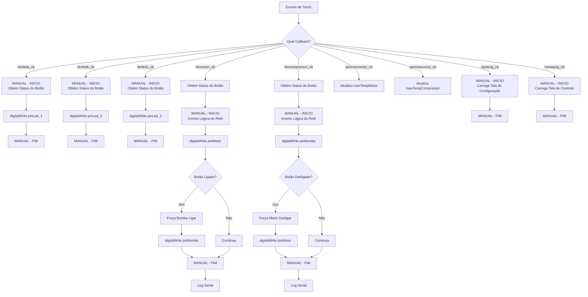

## Fluxograma de Configuração dos Widgets

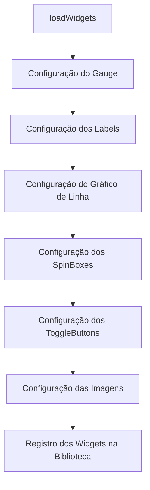

## Fluxograma das Telas

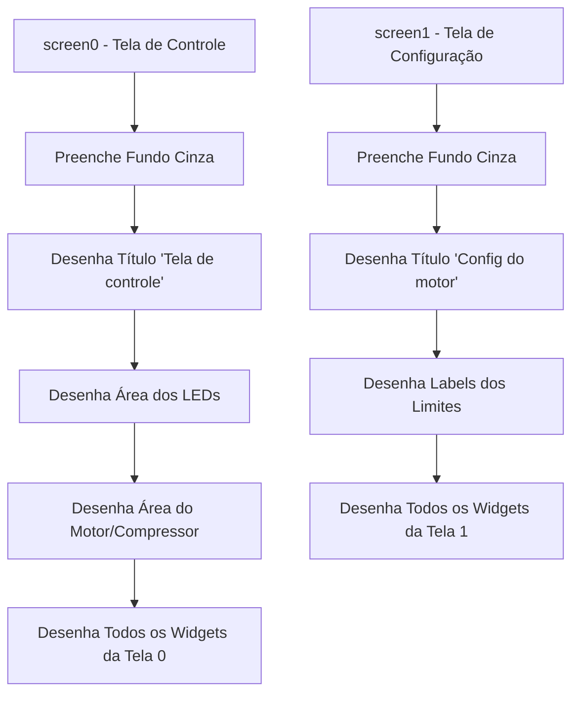

## Fluxograma do Timer e Leitura de Sensores

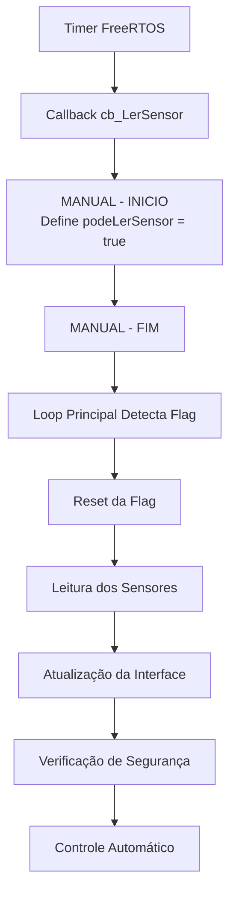

## Detalhamento dos Blocos MANUAL - INICIO/FIM

### 1. Declaração de Variáveis de Controle (Linhas 108-115)
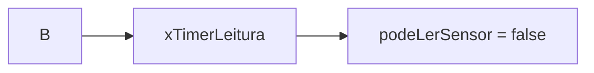

### 2. Função de Callback do Timer (Linhas 117-121)
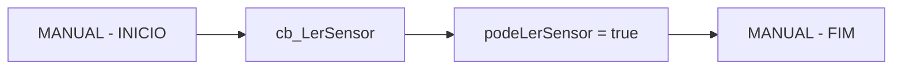

### 3. Criação do Timer no Setup (Linhas 175-178)
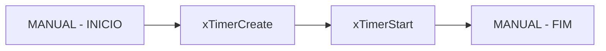

### 4. Loop Principal de Leitura (Linhas 183-230)
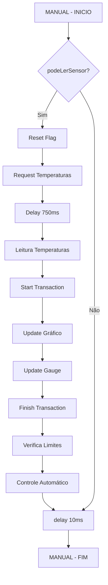

### 5. Callbacks dos LEDs (Linhas 520-540)
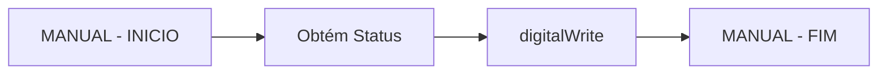

### 6. Callback do Motor (Linhas 542-565)
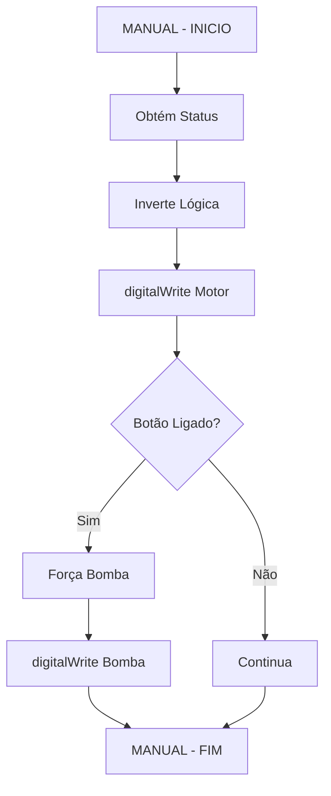

### 7. Callback do Compressor (Linhas 567-590)
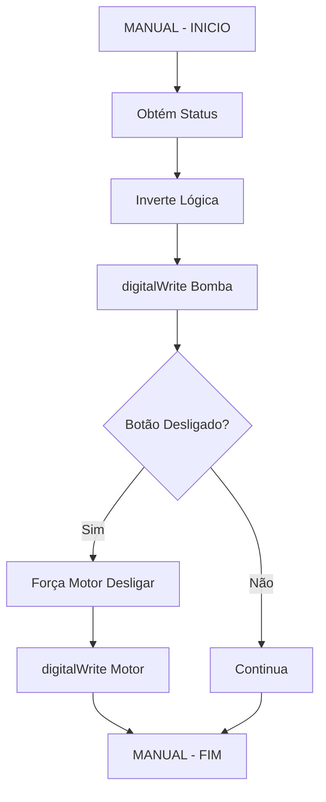

### 8. Callbacks de Navegação (Linhas 592-600)
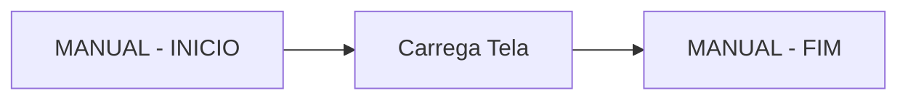

## Resumo dos Blocos MANUAL

Os blocos **MANUAL - INICIO** e **MANUAL - FIM** contêm:

1. **Variáveis de Controle**: Timer e flags para controle do sistema
2. **Timer FreeRTOS**: Sistema de agendamento para leitura periódica dos sensores
3. **Loop Principal**: Lógica de leitura de sensores, atualização da interface e controle automático
4. **Callbacks de Hardware**: Controle direto dos pinos de saída (LEDs, motor, compressor)
5. **Navegação**: Controle de mudança entre telas

Estes blocos representam a lógica de controle específica do sistema, separada da interface gráfica e configuração dos widgets. 