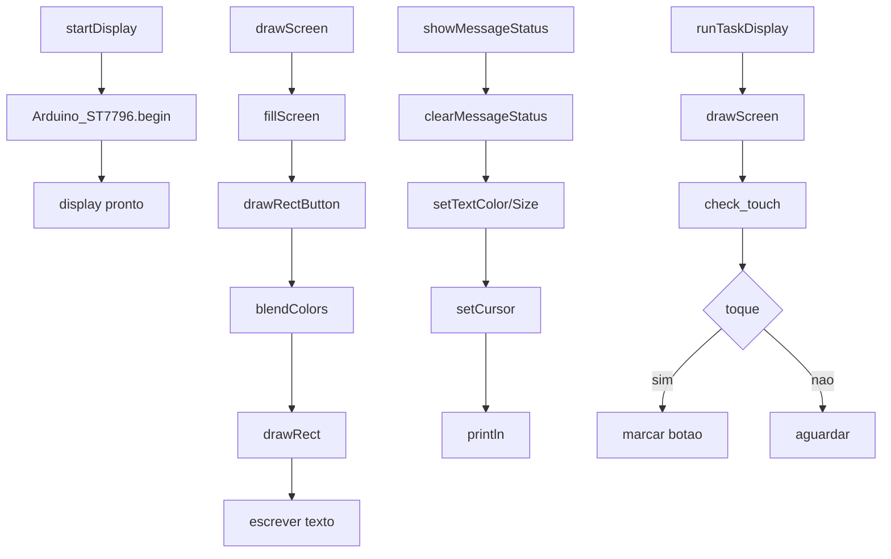

# display.h

Este arquivo concentra a inicialização do display (ST7796 via ArduinoGFX), renderização da UI (botões), exibição de mensagens de status e a task de leitura de touch/atualização visual.

## Visão geral
- Inicializa o barramento SPI compartilhado e o driver `Arduino_ST7796`.
- Mantém ponteiros globais para o barramento (`bus`) e para o driver do display (`tft`).
- Define tipos de botão (`CircleButton_t` e `RectButton_t`) e a enum `LedStatus`.
- Gerencia `rectButtons[]` e estados auxiliares de UI.
- Desenha tela/botões, LED de status e mensagens de rodapé.
- Cria/roda a task `runTaskDisplay`, que lê `check_touch` e atualiza a UI.

## Principais globais
- `bus` / `tft`: ponteiros para barramento e driver gráfico (ArduinoGFX).
- `taskDisplay`: handle da task FreeRTOS da UI.
- `POINT_IN_RECT` / `POINT_IN_CIRCLE`: macros de hit-test.
- `drawingScreen`, `showingMessage`, `eraseMessageAt`, `timoutMessage`.
- `rectButtons[]`, `amountButtons`, `idButton*`.

## Funções
- `startDisplay()`: inicializa SPI e ST7796; define rotação/frequência.
- `drawRectButton(RectButton_t&)`: botão com bordas em degradê e texto centralizado.
- `drawScreen()`: limpa a tela e desenha todos os botões.
- `showStatusLed(LedStatus)`: LED no canto superior-esquerdo.
- `clearMessageStatus()` / `showMessageStatus(const String&)`: barra de status inferior.
- `runTaskDisplay(void*)`: lê touch, detecta cliques, atualiza UI.
- `createTaskTestDisplay()`: cria a task do display no core 0.

## Diagrama de chamadas (Mermaid)

Notas:
- `check_touch` vem de `touch.h` e retorna coordenadas mapeadas.
- `blendColors` vem de `cores.h` e cria degradê RGB565.

## Fluxo típico
1. `startDisplay()` configura o display.
2. `createTaskTestDisplay()` cria a task que chama `runTaskDisplay()`.
3. A task desenha a tela (`drawScreen()`), lê o touch (`check_touch()`), marca cliques e atualiza destaques.
4. Mensagens de status via `showMessageStatus()` são ocultadas após `timoutMessage`.

