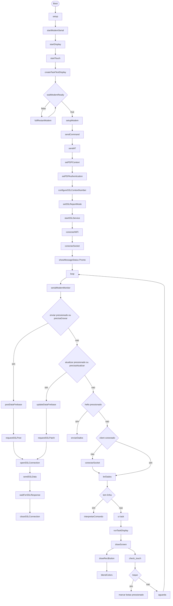

# Fluxo geral do projeto

Fluxo em cadeia iniciando no setup() e seguindo ate o loop().

```mermaid
flowchart TD
    %% Cadeia do setup
    Boot([Boot]) --> S0[setup]
    S0 --> S1[startModemSerial]
    S1 --> S2[startDisplay]
    S2 --> S3[startTouch]
    S3 --> S4[createTaskTestDisplay]
    S4 --> S5{waitModemReady}
    S5 -- false --> S5a[fullRestartModem]
    S5a --> S5
    S5 -- true --> S6[setupModem]

    %% Cadeia de setupModem
    S6 --> SM1[sendCommand]
    SM1 --> SM2[sendAT]
    SM2 --> SM3[setPDPContext]
    SM3 --> SM4[setPDPAuthentication]
    SM4 --> SM5[configureSSLContextNumber]
    SM5 --> SM6[setSSLReportMode]
    SM6 --> SM7[startSSLService]

    %% Conexao de rede
    SM7 --> N1[conectarWiFi]
    N1 --> N2[conectarSocket]
    N2 --> N3[showMessageStatus Pronto]

    %% Transicao para loop
    N3 --> L0[loop]

    %% Cadeia principal do loop
    L0 --> L1[serialModemMonitor]
    L1 --> L2{enviar pressionado ou precisaGravar}
    L2 -- sim --> L2a[postDataFirebase]
    L2a --> L2b[requestSSLPost]
    L2b --> L2c[openSSLConnection]
    L2c --> L2d[sendSSLData]
    L2d --> L2e[waitForSSLResponse]
    L2e --> L2f[closeSSLConnection]
    L2 -- nao --> L3{atualizar pressionado ou precisaAtualizar}
    L3 -- sim --> L3a[updateDataFirebase]
    L3a --> L3b[requestSSLPatch]
    L3b --> L2c
    L3 -- nao --> L4{hello pressionado}
    L4 -- sim --> L4a[enviarDados]
    L4 -- nao --> L5{client conectado}
    L5 -- nao --> L5a[conectarSocket]
    L5a --> L6[lerDados]
    L5 -- sim --> L6[lerDados]
    L6 --> L6a{tem linha}
    L6a -- sim --> L6b[interpretarComando]
    L6a -- nao --> L7[ui task]

    %% UI task (executa em paralelo, mas encadeada aqui)
    L7 --> U1[runTaskDisplay]
    U1 --> U2[drawScreen]
    U2 --> U3[drawRectButton]
    U3 --> U4[blendColors]
    U2 --> U5[check_touch]
    U5 --> U6{toque}
    U6 -- sim --> U7[marcar botao pressionado]
    U6 -- nao --> U8[aguarda]

    %% Loop volta ao inicio
    U8 --> L0
```

Notas: Cadeia linearizada para leitura, embora algumas rotinas ocorram em paralelo (task de UI).
