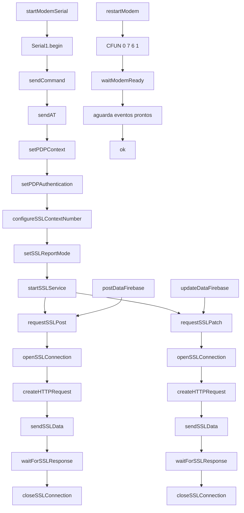

# modem.h

Modulo de integracao com o modem (ex.: SIM7670). Implementa comandos AT, gerenciamento de contexto PDP/APN e comunicacao SSL para requisicoes HTTP (POST/PATCH), alem de utilitarios de debug e monitoramento.

## Visao geral
- Inicializa Serial1 para o modem (startModemSerial).
- Encaminha dados entre USB e modem para depuracao (serialModemMonitor).
- Construtor de HTTP textual (createHTTPRequest).
- Envio generico de comandos e de comandos AT (sendCommand, sendAT).
- Configuracao de SSL e abertura/fechamento de sessoes (startSSLService, setSSLReportMode, configureSSLContextNumber, openSSLConnection, closeSSLConnection).
- Envio e leitura de dados SSL (sendSSLData, waitForSSLResponse).
- Requisicoes HTTP via SSL (requestSSLPost, requestSSLPatch).
- Configuracao do contexto PDP/APN (setPDPContext, setPDPAuthentication).
- Readiness do modem e reinicio (waitModemReady, restartModem, fullRestartModem).
- Operacoes de alto nivel para Firebase (postDataFirebase, updateDataFirebase).
- Setup completo do modem (setupModem).

## Globais e constantes
- CRLF, END_OF_TRANSMISSION: sequencias de controle.
- APN_t apnVivo, apnClaro, apnTim; currentApn selecionada.
- pdpContextId: id do contexto PDP; connectionFirebaseId: id de contexto SSL.
- Estruturas CCHHeader (cabecalho HTTP) e ResponseAT (resposta de comando).

## Funcoes principais
- startModemSerial()
- separetUrl(const String&, String&, String&)
- serialModemMonitor()
- createHTTPRequest(...)
- onlyWriteOnModem(const String&)
- sendCommand(const String&, const String&, unsigned long)
- sendAT(const String&, const String&, unsigned long)
- closeSSLConnection(uint8_t) / openSSLConnection(uint8_t, const String&, uint16_t)
- startSSLService() / setSSLReportMode(uint8_t, uint8_t) / configureSSLContextNumber(uint8_t, const String&, uint8_t)
- setPDPAuthentication(...) / setPDPContext(...)
- waitForResponde(const String&, unsigned long)
- waitForSSLResponse(unsigned long)
- sendSSLData(uint8_t, uint16_t, const String&)
- requestSSLPost(...) / requestSSLPatch(...)
- waitModemReady()
- restartModem() / fullRestartModem()
- postDataFirebase(const String&, const String&) / updateDataFirebase(const String&, const String&)
- setupModem()

## Diagrama de chamadas (Mermaid)

## Fluxo tipico
1. startModemSerial() inicia Serial1 e waitModemReady() garante readiness.
2. setupModem() configura PDP/APN e contexto SSL.
3. requestSSLPost()/requestSSLPatch() abrem sessao, enviam HTTP e leem resposta.
4. closeSSLConnection() encerra sessao quando solicitado.
5. postDataFirebase()/updateDataFirebase() usam as rotinas acima para Firebase.

