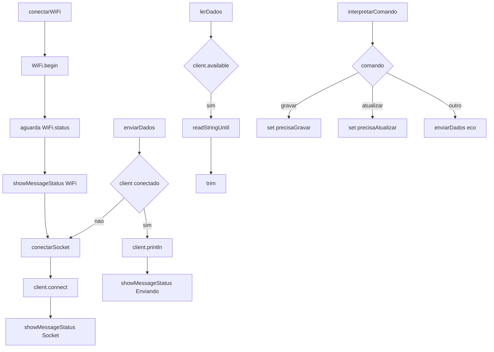

# rede_wifi.h

Arquivo responsável por conectar ao Wi‑Fi, gerenciar o socket TCP (`WiFiClient`) e interpretar comandos vindos do servidor.

## Visão geral
- Conecta ao AP usando `ssid`/`password` (de `variaveis.h`).
- Mantém `WiFiClient client` para I/O em TCP.
- Envia/recebe linhas de texto no socket.
- Interpreta comandos e seta flags para integrações (Firebase).
- Mostra feedback com `showMessageStatus` e logs na Serial.

## Globais
- `precisaGravarNoFirebase`, `precisaAtualizarNoFirebase`: flags de ação.
- `WiFiClient client`: conexão TCP com `serverIP:serverPort`.

## Funções
- `conectarWiFi()`: conecta ao Wi‑Fi; aguarda `WL_CONNECTED`.
- `conectarSocket()`: conecta `client` ao servidor.
- `enviarDados(const String&)`: envia linha; reconecta se preciso.
- `lerDados()`: lê uma linha até `\n` se houver dados.
- `interpretarComando(const String&)`: processa "gravar"/"atualizar" e responde.

## Diagrama de chamadas (Mermaid)

## Fluxo típico
1. `conectarWiFi()` estabelece Wi‑Fi e mostra IP.
2. `conectarSocket()` conecta ao servidor TCP.
3. `enviarDados()` escreve; se cair, reconecta e envia.
4. `lerDados()` retorna linhas limpas.
5. `interpretarComando()` ajusta flags e envia confirmação.

