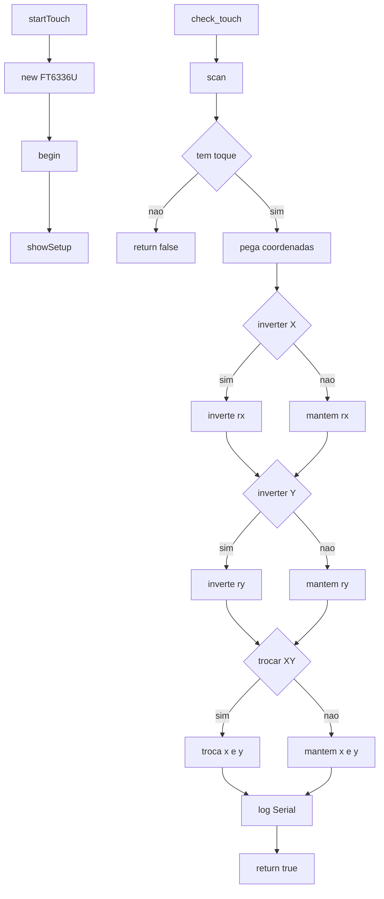

# touch.h

Integra o controlador capacitivo FT6336U: inicializacao, leitura de pontos de toque e impressao de diagnostico.

## Visao geral

- Aloca e inicializa `FT6336U` com pinos de `variaveis.h`.
- `showSetup()` imprime registros/versoes para debug.
- `check_touch(int*, int*)` le o estado, aplica mapeamento/inversoes e retorna coordenadas.

## Globais

- `FT6336U* obj_touch`: instancia do driver de touch.
- `FT6336U_TouchPointType tp`: ultimo snapshot lido com `scan()`.

## Funcoes

- `startTouch()`: cria `FT6336U`, chama `begin()` e `showSetup()`.
- `showSetup()`: le e imprime parametros/IDs do FT6336U.
- `check_touch(int* x, int* y)`: retorna se houve toque; preenche `x` e `y` mapeados.

## Mapeamento de coordenadas

- Inverte eixos conforme `TOUCH_INVERT_X`/`TOUCH_INVERT_Y`.
- Troca eixos se `TOUCH_SWAP_XY`.
- Usa `TOUCH_MAP_X1` e `TOUCH_MAP_Y1` para refletir a origem desejada.

## Diagrama de chamadas (Mermaid)

## Fluxo típico

1. `startTouch()` inicializa o controlador e imprime diagnóstico.
2. `check_touch()` lê pontos, converte para coordenadas de UI e informa se houve toque.
