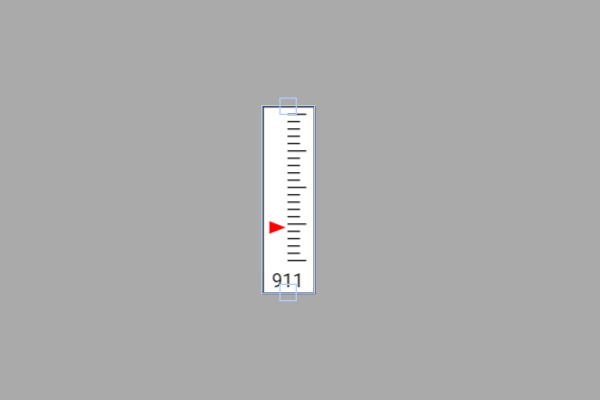

# Exemplo com VAnalog (barra analógica vertical)

Este exemplo mostra como **exibir o valor lido de um potenciômetro** em uma **barra analógica vertical (VAnalog)** na tela touchscreen usando a biblioteca **DisplayFK**.  
O widget é atualizado com a leitura **ADC (0–4095)** do ESP32 no **GPIO17**.

---

## Breve descrição do projeto

- O projeto inicializa display/touch e cria um `VAnalog` configurado com:
  - `minValue = 0`, `maxValue = 4095`, `steps = 10`
  - `width`/`height`, `arrowColor`, `textColor`, `backgroundColor`, `borderColor`
- No `loop()`, o valor do potenciômetro é lido e enviado ao widget (com atualização/animação conforme o parâmetro booleano):
  ```cpp
  vertalog.setValue(analogRead(potPin), true); // 0..4095
  ```
- Seções **(ESCRITO MANUAL)**:
  - definição do pino (`int potPin = 17;`)
  - `pinMode(potPin, INPUT);`
  - atualização periódica do VAnalog no `loop()`.

---

## Ligações do hardware (potenciômetro)

```
3V3 ──┬─────────┐           
      │         │               (terminal central - wiper)
      │      [ Potenciômetro ] ────► ESP32 (GPIO17)  // pino analógico
      │         │
GND ──┴─────────┘
```

- O **wiper** (terminal central) vai ao **GPIO17**.  
- Extremidades do potenciômetro em **3V3** e **GND**.  
- A escala do `VAnalog` (0–4095) casa com o ADC de 12 bits do ESP32.

---

## Imagem da montagem


Ou no esp32-S3


---

## Print da tela do projeto



---

## Resumo

O `VAnalog` representa o nível analógico com **marcadores graduados** e **ponteiro/indicador**, facilitando leituras rápidas.  
Com `analogRead(potPin)` alimentando o widget, a coluna vertical reflete instantaneamente o valor do potenciômetro na faixa **0–4095**.
