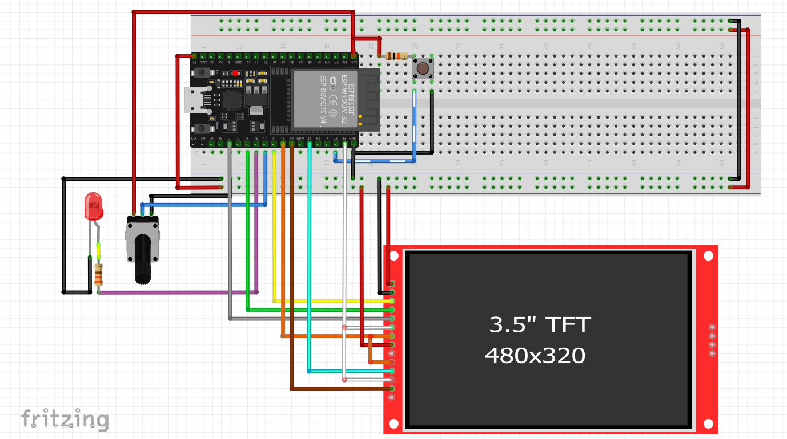
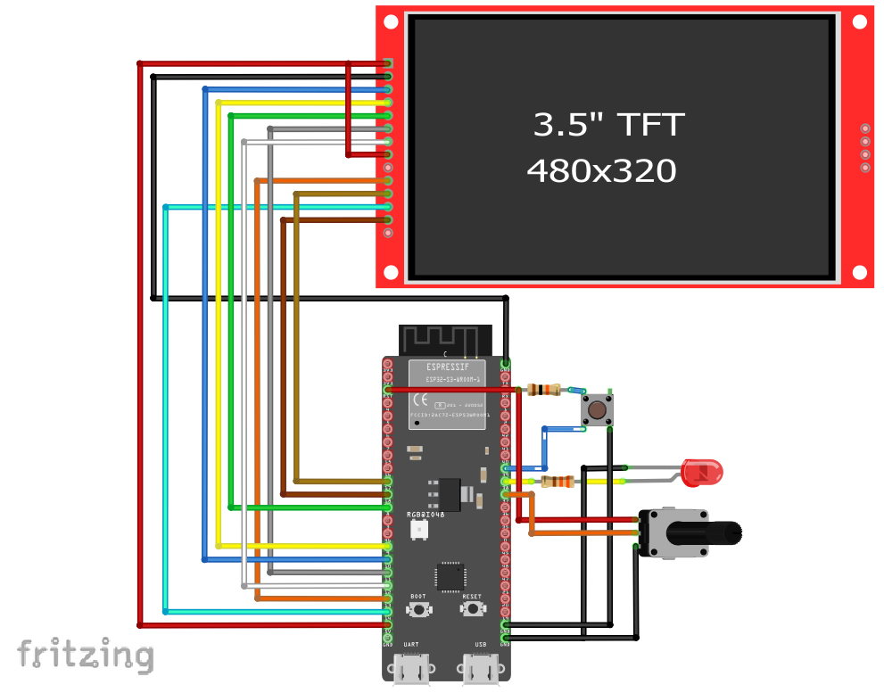
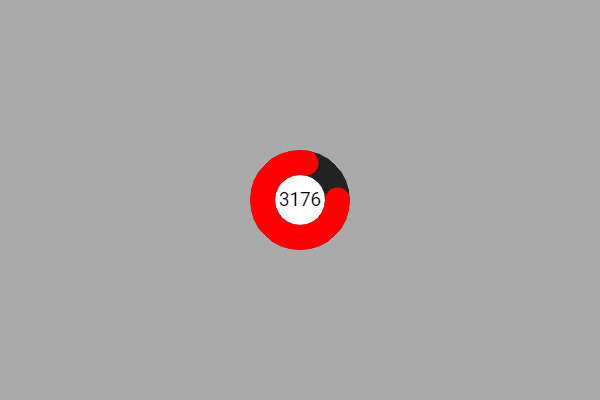

# Exemplo com CircularBar

Esse exemplo mostra como **exibir um nível percentual** (0–100%) em um **indicador circular (CircularBar)** na tela touchscreen usando a biblioteca **DisplayFK**.  
No código, o valor é atualizado com números aleatórios para demonstrar a animação do widget.

---

## Breve descrição do projeto

- O projeto inicializa display/touch e cria um `CircularBar` chamado `circload`.
- A cada ciclo do `loop()`, o valor do indicador é atualizado:
  ```cpp
  circload.setValue(random(0, 100)); // Atualiza o valor de 0 a 100%
  ```
- A aparência do círculo é definida em `CircularBarConfig`, incluindo:
  - `minValue = 0`, `maxValue = 100`
  - `startAngle = 0`, `endAngle = 360` (anel completo)
  - `radius` e `thickness` (tamanho e espessura)
  - `color`, `backgroundColor`, `textColor`
  - `showValue = true` (mostra o valor no centro)
  - `inverted = false` (sentido padrão de crescimento)

> Dica: para usar um **potenciômetro** (ou outra fonte analógica) no lugar do valor aleatório, converta a leitura ADC (0–4095) para percentual (0–100) e aplique no widget:
> ```cpp
> int raw = analogRead(GPIO_ANALOGICO);
> int pct = map(raw, 0, 4095, 0, 100);
> circload.setValue(pct);
> ```

---

## Imagem da montagem



Ou no esp32-S3



---

## Print da tela do projeto



---

## Resumo

O `CircularBar` é ideal para representar **progresso** ou **níveis percentuais** de forma clara e estética.  
Neste exemplo, o valor muda periodicamente para demonstrar a animação e a renderização do anel. Em cenários reais, basta alimentar o widget com a sua variável de interesse (potenciômetro, sensor, cálculo de progresso, etc.).
