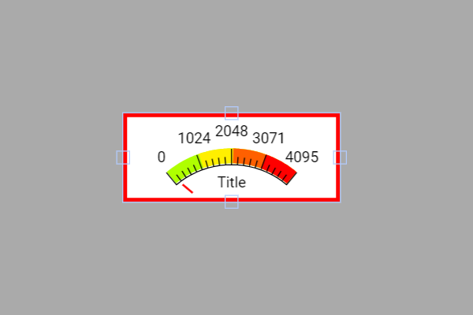

# Exemplo com Gauge (GaugeSuper)

Esse exemplo mostra como **exibir em tempo real o valor de um potenciômetro** em um **medidor analógico (Gauge)** na tela touchscreen usando a biblioteca **DisplayFK**.  
Ao girar o potenciômetro, o valor lido é atualizado no widget `GaugeSuper`, mudando o ponteiro e (se configurado) as faixas de cor.

---

## Breve descrição do projeto

- O projeto inicializa o display/touch, cria um `GaugeSuper` e define sua configuração (largura, faixa mínima/máxima, cores por intervalo, ponteiro, marcadores, etc).
- Um potenciômetro é lido periodicamente com `analogRead(potPin)` e seu valor é enviado ao gauge com:
  ```cpp
  widget.setValue(analogRead(potPin));
  ```
- As seções indicadas como **(ESCRITO MANUAL)** adicionam:
  - a definição do pino do potenciômetro (`int potPin = 17;`)
  - a atualização cíclica do gauge no `loop()`.

> Observação: `Gauge`, `LineChart`, `CircularBar`, `VerticalBar`, `AnalogBar` e `Termômetro` podem utilizar um **potenciômetro** para leitura e atualização do widget da mesma forma.  
> **Este exemplo demonstra o caso com o _Gauge_.**

---

## Ligações do hardware (potenciômetro)

Conecte o potenciômetro como **divisor variável**:

```
3V3 ──┬─────────┐
      │         │
      │      [ Potenciômetro ]
      │         │
GND ──┴─────────┘
            │ (terminal central - wiper)
            └──► ESP32 (GPIO17)  // pino analógico
```

- Use o **terminal central** (wiper) no **GPIO17** (pino analógico).
- Um terminal externo no **3V3** e o outro no **GND**.
- Faixa de leitura típica do ESP32: **0 a 4095** (12 bits), combinando com `minValue = 0` e `maxValue = 4095` do gauge.

---

## Imagem da montagem


Ou no esp32-S3


---

## Print da tela do projeto



---

## Resumo

O `GaugeSuper` torna intuitiva a visualização de valores analógicos lidos do ESP32.  
Neste exemplo, a leitura do potenciômetro **alimenta diretamente** o widget, exibindo o valor com ponteiro e faixas coloridas, útil para testes, calibração e demonstrações interativas.
