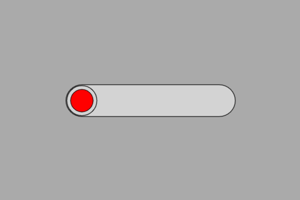

# Exemplo com HSlider (controle de brilho do LED)

Este exemplo mostra como **controlar o brilho de um LED** usando um **HSlider** na tela touchscreen (DisplayFK).  
O valor do slider (0–255) é enviado para `analogWrite()` no **GPIO16**, ajustando o **PWM** e, portanto, o brilho do LED.

---

## Breve descrição do projeto

- O projeto inicializa display/touch e cria um `HSlider` com faixa **0 a 255**.
- No callback `slider_cb()`, o valor do slider é lido e aplicado ao LED:
  ```cpp
  void slider_cb(){
      hslider0_val = slider.getValue(); // 0..255
      analogWrite(ledPin, hslider0_val); // PWM no GPIO16
  }
  ```
- `ledPin` é configurado como saída no `setup()`:
  ```cpp
  pinMode(ledPin, OUTPUT); // ledPin = 16
  ```

> Observação: Em alguns cores do ESP32, `analogWrite()` é um atalho para **LEDC**. Se sua instalação não suportar `analogWrite()`, use LEDC diretamente:
> ```cpp
> // setup()
> const int ch=0, freq=5000, res=8;
> ledcSetup(ch, freq, res);
> ledcAttachPin(ledPin, ch);
> // callback
> ledcWrite(ch, hslider0_val);
> ```

---

## Ligações do hardware (LED)

```
ESP32 (GPIO16) ──► Resistor 220–330 Ω ──► Ânodo do LED
                                        Cátodo do LED ──► GND
```

- **HIGH** = mais brilho (duty maior), **LOW** = menos brilho (duty menor).
- Se o LED parecer invertido, use:
  ```cpp
  analogWrite(ledPin, hslider0_val);
  ```

---

## Imagem da montagem


Ou no esp32-S3


---

## Print da tela do projeto



---

## Resumo

O `HSlider` fornece um controle intuitivo de **brilho via PWM**.  
A cada ajuste do slider, o callback envia o duty-cycle (0–255) para o **GPIO16**, variando suavemente o brilho do LED.
