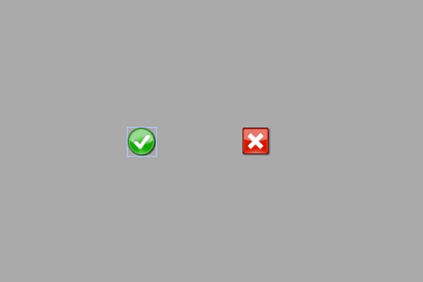

# Exemplo com Image/Icon (botões por imagem para LED)

Este exemplo mostra como **usar imagens na tela** (widget `Image`) como **botões** para **ligar/desligar** um LED físico no ESP32.  
Ao tocar na imagem **Okpng**, o LED no **GPIO16** acende; ao tocar na **Closepng**, o LED apaga.

---

## Breve descrição do projeto

- O projeto inicializa display/touch e carrega **duas imagens** do **SPIFFS**:
  - `/Okpng.fki` → callback `okpng_cb()` → `digitalWrite(pinLed, HIGH)`
  - `/Closepng.fki` → callback `closepng_cb()` → `digitalWrite(pinLed, LOW)`
- As imagens são configuradas com `ImageFromFileConfig` e registradas no DisplayFK.
- `pinLed` é configurado como saída no `setup()`:
  ```cpp
  pinMode(pinLed, OUTPUT); // pinLed = 16
  ```

### Callbacks (ligar/desligar)
```cpp
void okpng_cb(){
  Serial.println("Image Okpng clicked");
  digitalWrite(pinLed, HIGH);  // LED ON
}

void closepng_cb(){
  Serial.println("Image Closepng clicked");
  digitalWrite(pinLed, LOW);   // LED OFF
}
```

> Certifique-se de que os arquivos **`.fki`** estejam gravados no **SPIFFS** com os caminhos corretos (`data/Okpng.fki`, `data/Closepng.fki`).

---

## Ligações do hardware (LED)

```
ESP32 (GPIO16) ──► Resistor 220–330 Ω ──► Ânodo do LED
                                        Cátodo do LED ──► GND
```

---

## Imagem da montagem


Ou no esp32-S3


---

## Print da tela do projeto



---

## Resumo

Com o widget `Image`, ícones clicáveis funcionam como **botões**.  
Neste exemplo, **Okpng** liga e **Closepng** desliga o LED no **GPIO16**, oferecendo uma interface intuitiva com elementos gráficos.
