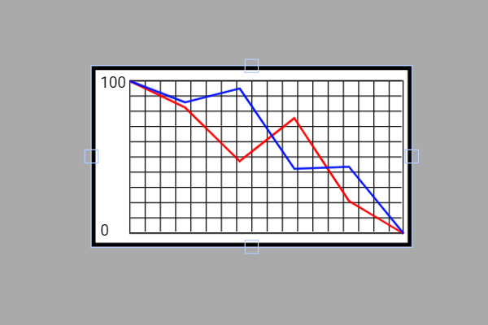

# Exemplo com LineChart

Esse exemplo mostra como **plotar em tempo real** o valor de um potenciômetro em um **gráfico de linhas (LineChart)** na tela touchscreen usando a biblioteca **DisplayFK**.  
A série **0** recebe amostras do potenciômetro, enquanto a série **1** usa valores aleatórios para comparação/diagnóstico.

---

## Breve descrição do projeto

- O projeto inicializa display/touch e cria um `LineChart` com **duas séries** e faixa de valores **0 a 4095** (12 bits do ADC do ESP32).
- No `loop()`, os pontos são adicionados ao gráfico:
  ```cpp
  linechart.push(0, analogRead(potPin)); // Série 0: valor do potenciômetro
  linechart.push(1, random(0, 4095));    // Série 1: referência aleatória
  ```
- A cada chamada de `push()`, o gráfico é atualizado, exibindo a curva correspondente.  
- As cores das séries e demais propriedades (grade, linhas, rótulos) são definidas na `LineChartConfig`.

> Observação: assim como outros widgets (Gauge, CircularBar, etc.), o `LineChart` pode receber leituras de **qualquer sinal analógico** do ESP32 — aqui usamos um **potenciômetro** como fonte de dados.

---

## Ligações do hardware (potenciômetro)

Conecte o potenciômetro como **divisor variável**:

```
3V3 ──┬─────────┐
      │         │
      │      [ Potenciômetro ]
      │         │
GND ──┴─────────┘
                │ (terminal central - wiper)
                └──► ESP32 (GPIO17)  // pino analógico
```

- Use o **terminal central** (wiper) no **GPIO17** (entrada ADC).
- Um terminal externo no **3V3** e o outro no **GND**.
- Faixa típica de leitura do ADC do ESP32: **0 a 4095**, compatível com `minValue = 0` e `maxValue = 4095` do gráfico.

---

## Imagem da montagem


Ou no esp32-S3


---

## Print da tela do projeto



---

## Resumo

O `LineChart` é ideal para **visualizar tendências e flutuações** de sinais analógicos no ESP32.  
Neste exemplo, a leitura do potenciômetro alimenta a **série 0** e uma **série 1** opcional com dados aleatórios ajuda a validar o comportamento do gráfico e a configuração de escalas/cores.
