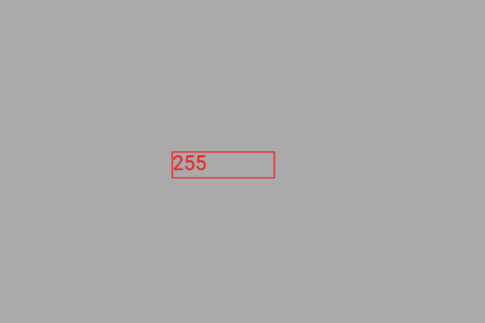

# Exemplo com NumberBox (controle de brilho do LED)

Este exemplo mostra como **controlar o brilho de um LED** usando um **NumberBox** na tela touchscreen (DisplayFK).  
O valor digitado no NumberBox (via teclado numérico/Numpad) é convertido para **0–255** e enviado para `analogWrite()` no **GPIO16**, ajustando o **PWM** e, portanto, o brilho do LED.

---

## Breve descrição do projeto

- O projeto inicializa display/touch e cria um `NumberBox` com valor inicial **255**.
- O **Numpad** é estilizado via:
  ```cpp
  Numpad::m_backgroundColor = CFK_GREY3;
  Numpad::m_letterColor     = CFK_BLACK;
  Numpad::m_keyColor        = CFK_GREY13;
  ```
- No callback `numberbox_cb()`, o valor digitado é obtido, **tratado** e aplicado ao LED:
  ```cpp
  void numberbox_cb(){
      nb0_val = numberbox.getValue();   // valor em float vindo do widget
      int value = tratarValor(nb0_val); // garante faixa 0..255 (int)
      analogWrite(ledPin, value);       // PWM no GPIO16
  }
  ```
- `ledPin` é configurado como saída no `setup()`:
  ```cpp
  pinMode(ledPin, OUTPUT); // ledPin = 16
  ```

> Observação: No trecho original, após calcular `value = tratarValor(nb0_val)`, o código chamava `analogWrite(ledPin, nb0_val);`.  
> Aplique sempre o **valor tratado** (inteiro 0–255), como no exemplo acima.

---

## Função de tratamento (0–255, inteiro)

```cpp
int tratarValor(float number) {
    if (number > 255 || number < 0) {
        return number > 255 ? 255 : 0;
    } else {
        return (int)number;   // converte para inteiro (truncando)
    }
}
```

> Se preferir **arredondar** em vez de truncar, use `return (int)round(number);` (requer `<math.h>`).

---

## Alternativa LEDC (caso `analogWrite()` não esteja disponível)

```cpp
// setup()
const int ch=0, freq=5000, res=8; // 8 bits → 0..255
ledcSetup(ch, freq, res);
ledcAttachPin(ledPin, ch);

// callback
ledcWrite(ch, value);
```

---

## Ligações do hardware (LED)

```
ESP32 (GPIO16) ──► Resistor 220–330 Ω ──► Ânodo do LED
                                        Cátodo do LED ──► GND
```

- **Valores maiores** no NumberBox ⇒ **duty** maior ⇒ **mais brilho**.  
- Se o LED parecer invertido, use:
  ```cpp
  analogWrite(ledPin, 255 - value);
  ```

---

## Imagem da montagem


Ou no esp32-S3


---

## Print da tela do projeto



---

## Resumo

O `NumberBox` permite inserir diretamente um **valor exato** para o PWM.  
Ao confirmar no Numpad, o callback trata e envia o duty-cycle (0–255) para o **GPIO16**, variando suavemente o brilho do LED com **precisão**.
