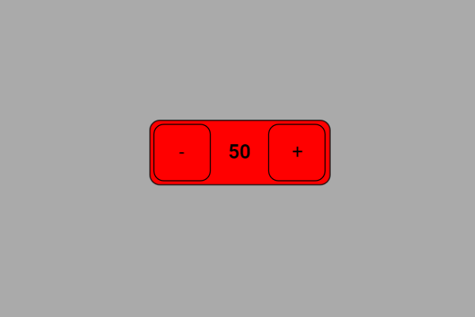

# Exemplo com SpinBox (controle de brilho do LED)

Este exemplo mostra como **controlar o brilho de um LED** usando um **SpinBox** na tela touchscreen (DisplayFK).  
O valor numérico do `SpinBox` (0–255) é enviado para `analogWrite()` no **GPIO16**, ajustando o **PWM** e, portanto, o brilho do LED.

---

## Breve descrição do projeto

- O projeto inicializa display/touch e cria um `SpinBox` com:
  - `minValue = 0`, `maxValue = 255`, `step = 1`, `startValue = 54`.
- No callback `spinbox_cb()`, o valor do SpinBox é lido e aplicado ao LED:
  ```cpp
  void spinbox_cb(){
      spin0_val = spinbox.getValue(); // 0..255
      analogWrite(ledPin, spin0_val); // PWM no GPIO16
  }
  ```
- `ledPin` é configurado como saída no `setup()`:
  ```cpp
  pinMode(ledPin, OUTPUT); // ledPin = 16
  ```
- O `loop()` permanece leve; a atualização acontece no **callback** do widget.

> Observação: Em alguns cores do ESP32, `analogWrite()` é um atalho para **LEDC**. Se sua instalação não suportar `analogWrite()`, use LEDC diretamente:
> ```cpp
> // setup()
> const int ch=0, freq=5000, res=8;   // 8 bits → 0..255
> ledcSetup(ch, freq, res);
> ledcAttachPin(ledPin, ch);
> // callback
> ledcWrite(ch, spin0_val);
> ```

---

## Ligações do hardware (LED)

```
ESP32 (GPIO16) ──► Resistor 220–330 Ω ──► Ânodo do LED
                                        Cátodo do LED ──► GND
```

- **Valores maiores** no SpinBox ⇒ **duty** maior ⇒ **mais brilho**.  
- Se o LED parecer invertido, use:
  ```cpp
  analogWrite(ledPin, spin0_val);
  ```

---

## Imagem da montagem


Ou no esp32-S3


---

## Print da tela do projeto



---

## Resumo

O `SpinBox` fornece um **controle preciso** de brilho via PWM.  
A cada incremento/decremento, o callback envia o duty-cycle (0–255) para o **GPIO16**, variando suavemente o brilho do LED.
