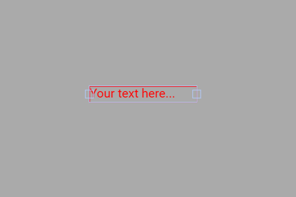

# Exemplo com TextBox (comando ON/OFF para LED)

Este exemplo mostra como **usar um TextBox** na tela touchscreen (DisplayFK) para **ligar/desligar** um LED físico no ESP32 digitando um comando de texto.  
Quando o usuário digita **"ON"** (maiúsculas/minúsculas ignoradas), o LED no **GPIO16** acende; **qualquer outro valor** apaga o LED.

---

## Breve descrição do projeto

- O projeto inicializa display/touch, estiliza o teclado (`WKeyboard`) e cria um `TextBox` com texto inicial.
- Ao tocar no campo, o **teclado virtual** aparece para digitação.
- No **callback** `textbox_cb()`, o texto digitado é lido e a lógica define o estado do LED **de forma case-insensitive**:
  ```cpp
  void textbox_cb(){
      tb0_val = textbox.getValue();
      bool on = String(tb0_val).equalsIgnoreCase("ON"); // ignora maiúsculas/minúsculas
      digitalWrite(pinLed, on ? HIGH : LOW);            // acende/apaga o LED
  }
  ```
- `pinMode(pinLed, OUTPUT);` é configurado no `setup()` (padrão **GPIO16**).

---

## Ligações do hardware (LED)

```
ESP32 (GPIO16) ──► Resistor 220–330 Ω ──► Ânodo do LED
                                        Cátodo do LED ──► GND
```

---

## Imagem da montagem


Ou no esp32-S3


---

## Print da tela do projeto



---

## Resumo

O `TextBox` permite **comandos por texto** diretamente na UI.  
Com a comparação **case-insensitive**, digitar **"ON"** acende o LED; qualquer outro texto o apaga — simples para testes, menus e automações básicas.
