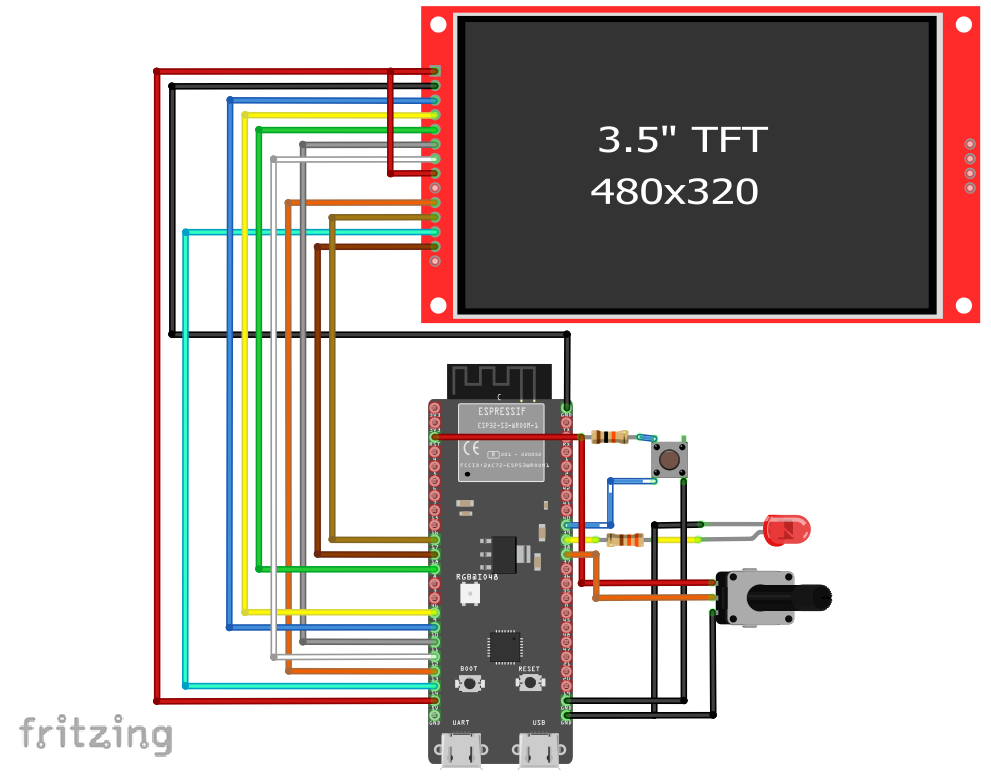

# Exemplo com TextButton (toggle do LED)

Este exemplo mostra como **usar um TextButton** na tela touchscreen (DisplayFK) para **alternar** o estado de um LED físico no ESP32.  
Ao tocar no botão, o LED no **GPIO16** muda entre **ligado** e **desligado**.

---

## Breve descrição do projeto

- O projeto inicializa display/touch e cria um `TextButton` (largura 150, altura 50, raio 10) com fundo `CFK_COLOR01` e texto `CFK_WHITE`.
- O **callback** `textbutton_cb()` é chamado a cada toque e faz o **toggle** do LED:
  ```cpp
  void textbutton_cb(){
      Serial.print("Clicked on: "); Serial.println("textbutton_cb");
      ledState = !ledState;            // inverte o estado
      digitalWrite(pinLed, ledState);  // aplica no GPIO16 (LED)
  }
  ```
- `pinLed` é configurado como saída no `setup()`:
  ```cpp
  pinMode(pinLed, OUTPUT); // pinLed = 16
  ```

> Dica: o `delay(2000)` no `loop()` não interfere no toggle (a troca ocorre no callback), mas para uma UI mais responsiva é comum usar delays menores ou lógica baseada em `millis()`.

---

## Ligações do hardware (LED)

```
ESP32 (GPIO16) ──► Resistor 220–330 Ω ──► Ânodo do LED
                                        Cátodo do LED ──► GND
```

- Se o LED parecer invertido (acende quando deveria apagar), troque a ligação ou faça:
  ```cpp
  digitalWrite(pinLed, !ledState);
  ```

---

## Imagem da montagem


Ou no esp32-S3



---

## Print da tela do projeto


---

## Resumo

O `TextButton` oferece um controle simples e direto para **acionar/alternar** atuadores físicos.  
Com poucas linhas no callback, a interação da tela é refletida no **LED do GPIO16**, ideal para testes, menus e confirmações.
