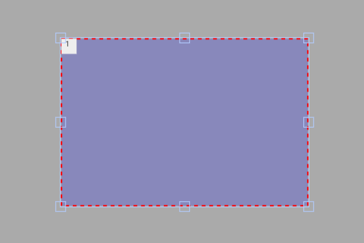

# Exemplo com TouchArea (toggle do LED)

Este exemplo mostra como **usar uma área sensível ao toque (TouchArea)** para **alternar** o estado de um LED físico no ESP32.  
Ao tocar dentro da área, o LED no **GPIO16** muda entre **ligado** e **desligado**.

---

## Breve descrição do projeto

- O projeto inicializa display/touch e cria uma `TouchArea` (325×220 px) na tela.
- Sempre que a área é tocada, o **callback** é chamado.
- No callback, fazemos o **toggle** de um `bool ledState` e escrevemos no pino do LED.

### Ajuste importante no callback
No código que você colou, o LED **não alterna** porque `ledState` nunca muda.  
Basta **inverter** o estado antes de escrever:

```cpp
void touchaarea_cb(){
    Serial.println("AreaTouch was clicked");
    ledState = !ledState;            // <-- inverte o estado
    digitalWrite(pinLed, ledState);  // aplica no GPIO16
}
```

> Dica: se quiser que o LED acenda **apenas enquanto o dedo está tocando** (e apague ao sair), implemente `press`/`release` na lib ou use uma flag de “isPressed” se disponível. Para *toggle*, o código acima é o suficiente.

---

## Ligações do hardware (LED)

```
ESP32 (GPIO16) ──► Resistor 220–330 Ω ──► Ânodo do LED
                                        Cátodo do LED ──► GND
```

- `pinMode(pinLed, OUTPUT);` já está no `setup()`.
- Se o LED parecer invertido, troque a ligação ou escreva `digitalWrite(pinLed, !ledState);`.

---

## Imagem da montagem


Ou no esp32-S3


---

## Print da tela do projeto



---

## Resumo

A `TouchArea` é útil para **regiões personalizadas de interação** (ex.: áreas grandes, botões invisíveis, “tap to toggle”).  
Com um simples **toggle** no callback, você espelha a interação da tela em um **atuador físico** (LED no GPIO16), ideal para testes e demonstrações rápidas.
